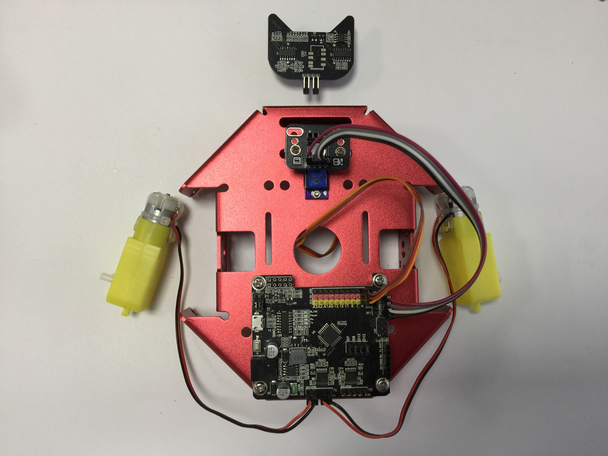
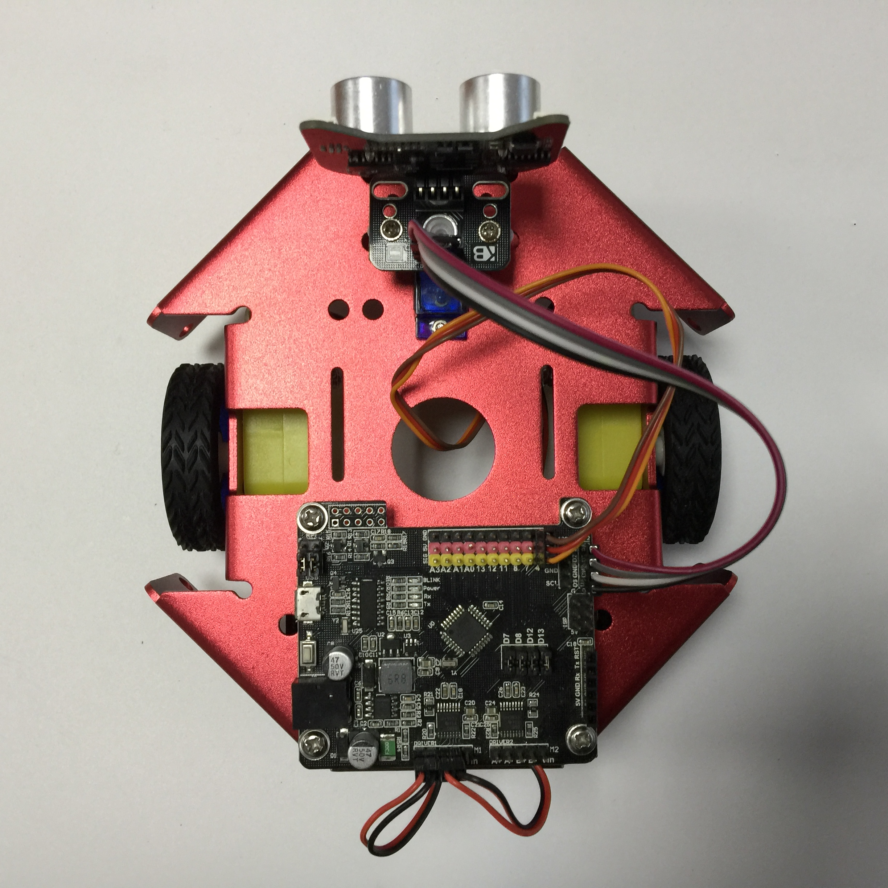

# Introduction and mechanical assembly instructions

## Kittenbot Introduction

Thank you so much for choosing kittenbot robotics. The following series of tutorials will lead and open the door to graphical programming.

Kittenbot Robotic kit is the first production of Kittenbot Team. It has a sheet metal body, with finely crafted process, make it stable and good looking. At the same time, there are many compatible holes in the sheet metal car, which can be easily combined with the LEGO blocks.

In addition to being a DIY remote control car, you can also turn it into a drawing robot and draw different patterns according to your instructions. With our expansion kit, you can also upgrade to tank cars, casters, omniwheels, and more.

We have also developed a Scratch3 based graphical programming software to coop with this kit, names Kittenblock.

For children, we wish kids to focus more on graphical programming without worrying about the grammar of code programming and improving children's programming confidence. It can also quickly improve the level of programming education and establish programming education for schools or training. The core concept of Kittenblock if to focus more on logical thinking and problem solving than on tedious programming processing.

For teachers, the Kittenbot robot not only cultivates students' hands-on skills but also enhances students' programming thinking and ability to solve actual problems. 
With kittenbot's kits, you may quickly improve the level of programming education and establish programming education for schools or training.
We will provide detailed tutorials on upcoming serials robotic kits. Actually, we have tested our product and software in real teaching scene over China, HongKong and Taiwan, and confident to push it to global.

For makers, Kittenbot robot is your stepping stone to open the programming robot door. Kittenbot use an Arduino Uno compatible mainboard. If you find it difficult to get started with arduino, or if you want to master electronic programming techniques, you may wish to start with the Kittenbot robot. Beyoned a entry level tutorial kit, kittenbot is also situable to make all kinds of DIY projects.

## What is included in kittenbot robotic kit

* DC Motor
* 9 Gram Mini Servo
* 28BYJ Stepper motor
* LED lights Module
* Cat Ear Ultrasonic Sensor with rgb lights
* Buzzer Module
* Button Module
* Inf RGB Ring Module
* WIFI Module, etc

## Assembly

There is a detailed instructoin shipped with this kit. We belive you may find no diffcult on assembling.

Here again some note on mistakes you may take.

Because the series of tutorials are based on the following connection or wiring, we hope you follow these connections, or you may find the robot won't act as expected.

### Error-prone

1. Left and right motor socket, the left side is inserted on the left, the right side is inserted on the right (as pictured)
2. The red and black lines of the motor cable should pay attention to the order of insertion (red and black on the right)
3. Servo 3PIN Installation Order (Pin Order)
4. 4PIN ultrasonic adapter board mounting sequence (pin order)

### After Finish

No difficulty, just patient and check it carefully.

On the folloing tutorials, we will open the door to graphical programming of Kittenbot robot.

## FAQ:

### Accidentally smoke the mainboard with wrong wiring？

Normally no, wrong wiring will just prevent the modules to work the right way. But we still encourage you to check the wiring as pictured before powering on.

### What if I still have a lot of modules left after assembly?

Kittenbot robots can be equipped with some common electronic modules in addition to the assembly of a car. We will show in the upcoming tutorials.

### Why my robot don't move after powering on？

Kittenbot is not a electric toy car, its main function is to learn programming. So you need programming to make it do something.

### Where is the power switch on the Kittenbot?

The mainboard of kittenbot is named RosBot, there is no power switch. All you need to do is just unplug the power plug.

### What is the voltage input of Kittenbot?

The power socket accept 5~12V input. You may also power the robot from usb with portable power source.

The kit comes with a battery box that holds six AA batteries, should be enough for play aroud. For the sake of shippment restrict oversea we can't give you a more powerful power source, sorry for that. We still hope you can get it a more powerful equitment upgrade.

### Will the robot damaged with both usb and extenal power plugged in?

No, we have internal power source checking circuit.

### Can I unplug the jumpper near the usb port?

No, every jump cap on the circuit board has its role. Make sure you know what you are doing before removing any of it.

### What is the use of that WIFI module?

It give you access to control the robot wirelessly, we have provide an App may sync your scratch3 programe to run on mobile phone. We will show you in the advanced tutorials, for now use usb cable only. 

### What is the function of the button next to usb port?

The mainboard's reset button. If you want to re-execute the program or restart the car, you can press the reset button.

### Can I make it a linefollow patrol robot?

Kittenbot robots support extensions. We provides a five-way black line inspection module. If you want it, you need to purchase them separately.

### What is the difference between the Rosbot and Arduino?

In fact, their cores are the same. It can be understood that Rosbot is an upgraded version of Arduino. Because Rosbot has integrated some of the motor's driver chips, and wifi Bluetooth expansion, interface, I2C interface and so on.

### Can I use Arduino IDE?

Yes, if you use the Arduino IDE for programming, please choose UNO in the board list. You may also need to copy the arduino libraries under the kittenblock install folder to you arduino IDE.

For beginners, we advice you to try translate graphical blocks to c++ code in Kittenblock. 

### Is there a document for Arduino control instructions?

For now Kittenbot robots are primarily targeted at primary and secondary school students and enthusiasts who do not understand electronics. We may finish this part later.
