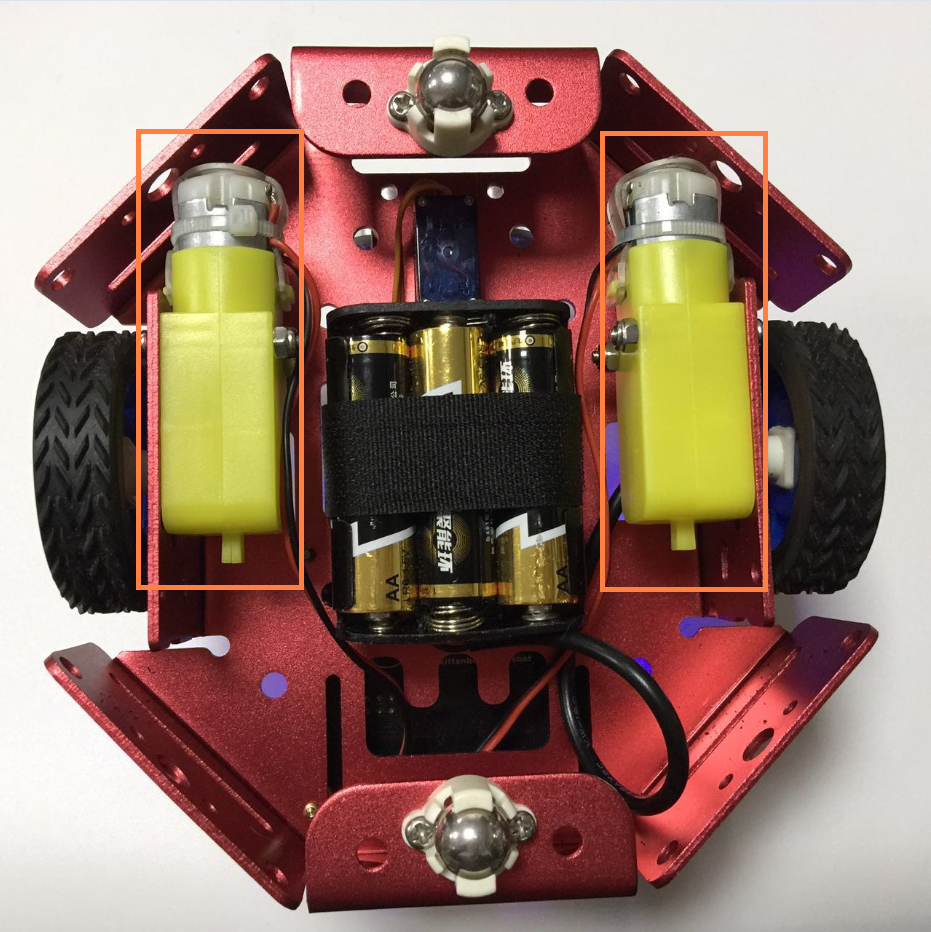
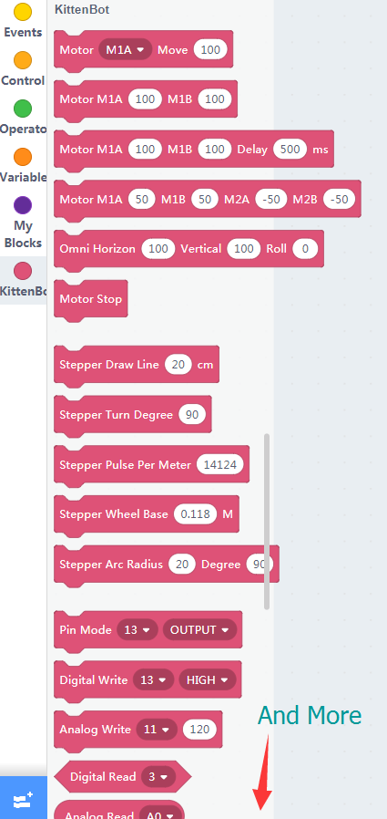
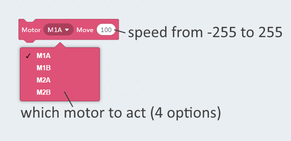
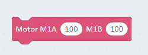
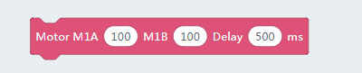
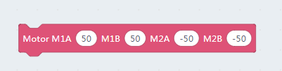
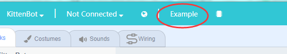
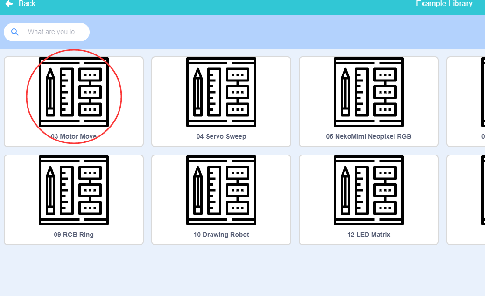
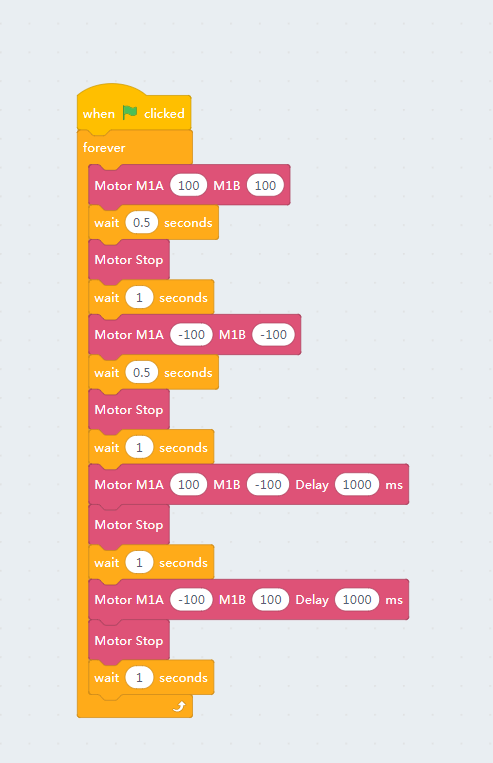
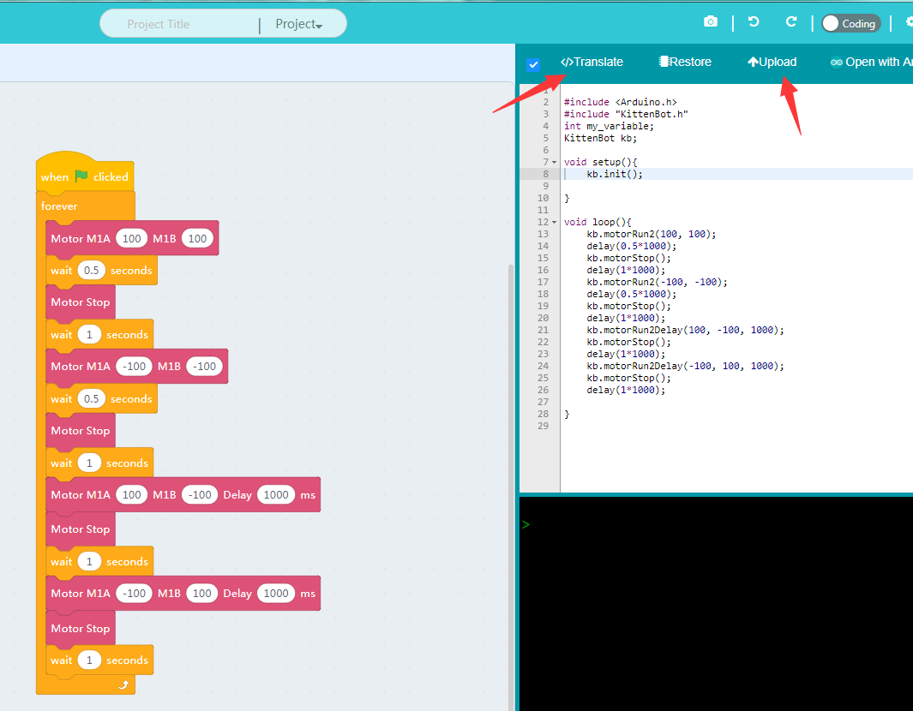

# Motor Move

## The motor mounted on metal chassis

## Graphical blocks for kittenbot

The first group of blocks for motor controlling. And we will only use these guys in this tutorial.

## Functional description of the blocks

**You may find the M1A~M2B definition on rosbot mainboard**

### single motor execute 

### dual motor execute

### dual motor with delays in milliseconds

The up two blocks major for a two wheel control robot.

### quad motor control

This block majors on macnum wheel control or a project need may motors.

## To test the block

- Drag your desired function to workspace.
- Set a speed and a motor slot
- Then click the block.
- Check how the motor runs responding to the blocks you clicked.

**Make sure you have restored the firmware and opend the communication port.**

## The difference between online mode and offline mode

### Online mode：

You have both kittenblock and serial com port opened. Actually, kittenblock send commands to default firmware to execute peripheral functions.

### Offline mode：

When you are confident that the programme works, try to translate into arduino c++ code and download to the mainboard.

The internal arduino build of kittenblock will translate the c++ code to a hex firmware and overwrite the default firmware. Every power recycles or reset will make the programme to start over again.

The offline mode you don't need kittenblock communicating to mainboard, neither you can click a block and make it run. 

## The motor example

Try to load the motor example from top menubar **Example** button

Find the motor move example

Click to load the example, and click the green flag to see how it works.

Then switch to the coding panel and translate all the blocks to c++ code

Upload your code to the mainboard. Then unplug the USB cable and use an external power source to check if the robot works as the online mode.

PS: You need **Green Flag** to start a run process or a c++ code translate entry.

## Debugs

If you find your robot won't work, please check the list below:

- Is the robot type selected correctly?
- Is it connected to the COM port?
- Is the USB cable connected?
- Are the blocks correct? Missing green flag blocks?