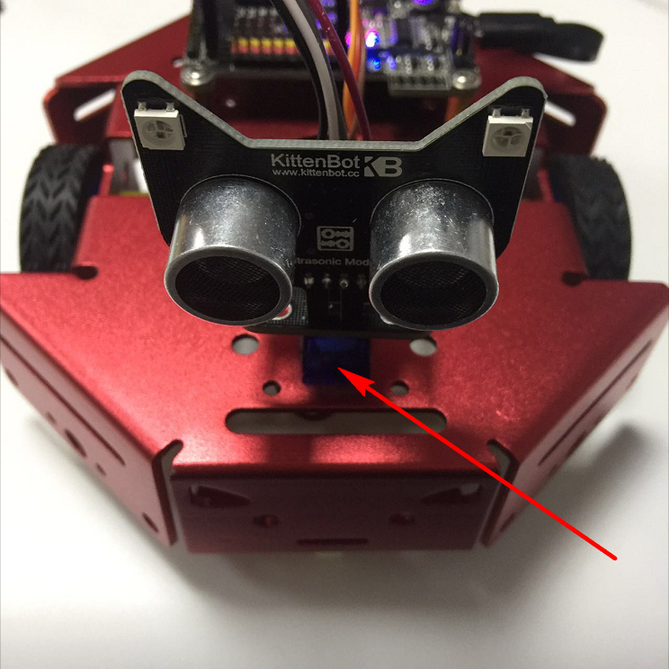
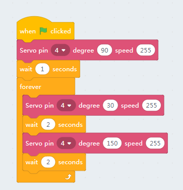
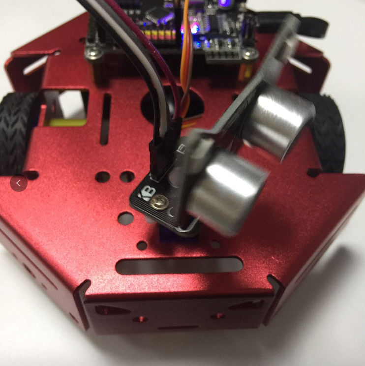

# ServoSweep

## Servo Mount

## Blocks for servos

Here is the servo block, the first slot indicate which pin you plug you servo in. The 2nd slot is the degree to move to. The last slot is the speed, 255 means to turn to destination degree instantly.

## Sweep Servo online

**Make sure you have restore the firmware before using online mode**

Drag the block to the workspace area, you can set the angle range from 0-180. It is generally recommended not to use the limit value, it may tremble due to the individual differences of the servo.

Try to set a small speed value to see how the servo move to target degree. Then a large speed. 

Now, let's make a servo sweep programme as pictrued below

Click the green flag above the stage

Or just click the green flag block

Seee... The servo sweeps ~ :p

Now try to modify the speed of each servo block.

Be notice that we need manually insert a delay block between each sweep as the block run asynchronously.
 

## Make the robot's head sweeping：

Just translate the graphical block to c++ code as we narrate in last tutorial.

You can also join the motor movement command with the servo turning blocks together. By make it sweeping while running around.

## Debug

Again the checking list if you find your robot won't work.

- Is the robot type selected correctly?
- Is it connected to the COM port?
- Is the USB cable connected?
- Are the blocks correct? Missing green flag blocks?
