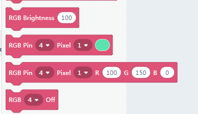

# Nekomimi RGB pixel

## The Nekomimi Module

There is a very cute ultrasonic module shipped with kittenbot basic kit. We give it a cute name too, 'NekoMimi' which means cat's ears.

## Wiring

To make the ultrasonic module sweep with the servo, we need an adapter board. And plug the nekomimi module onto the adapter board.

Adapter->Mainboard

- V —— 5V
- 1 —— D2
- G —— GND
- 2 —— D3

Double check the wiring before you power on. 

In this tutorial, we only show how to control the RGB pixel to the ears.

## Blocks description

There are four blocks in kittenblock to control RGB neopixels, which may compatible with any ws2812 based module or strips.

You may figure the function by the name, here we go detailed into the basic pixel setting block.

The functional slots from left to right are:

- which pin used to control the RGB pixel
- which pixel you want to manipulate
- the color panel

## Play the RGB pixel in online mode

**Make sure you have restored the firmware before using online mode**

Drag in couple RGB blocks, make sure you set the PIN to 3 on each block.

Click on each block to see if the RGB pixel works. 

Be noticed that we have only two pix on our module, any pixel index setting over 2 won't work. If you have an RGB strip you may connect it to the mainboard and take a try.

## RGB pixel looping

Drag a graphical code as shown below, you may also find it in the example panel.

Click the green flag to see if it works.

Next, translate the blocks to c++ and solidify to the mainboard.

 
