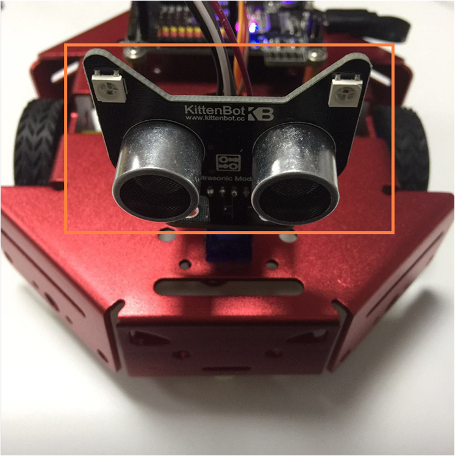
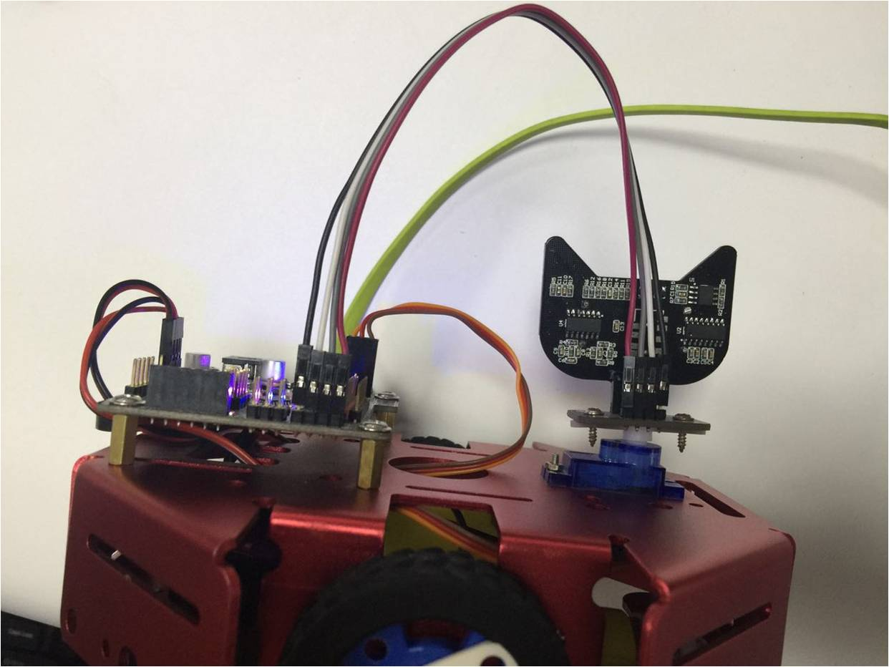
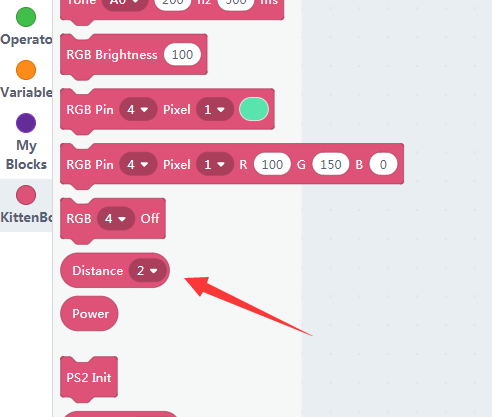
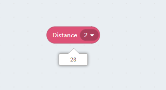
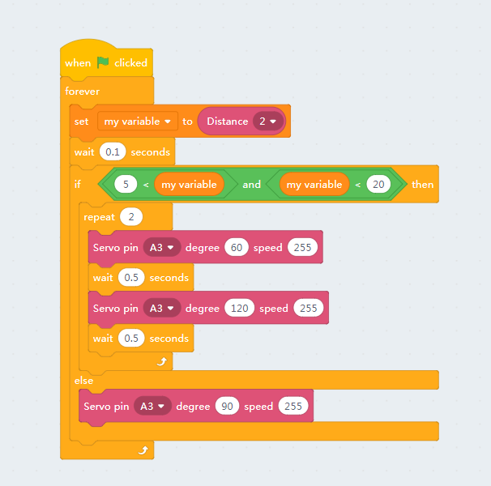
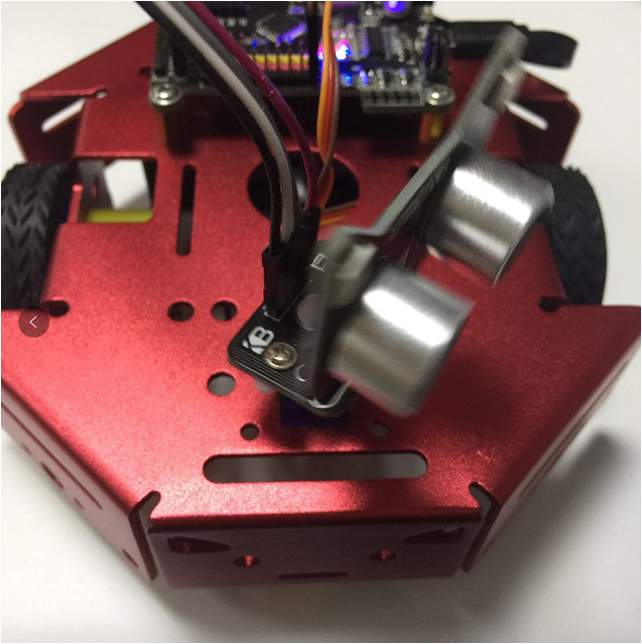

# Nekomimi Ultrasonic Sensor

## The Ultrasonic Sensor

## Wiring

The wiring is the same as last post, and double check the wiring before you power on. 

Adapter->Mainboard

- V——5V
- 1——D2 // The Ultrasonic Sensor
- G——GND
- 2——D3 // The RGB pixel

## Block for distance sensing

There is only one input slot in the block, which PIN you connect to.

The detecting distance ranging from 5~200cm.

## Read distance

**Make sure you have restored the firmware before using online mode**

Drag a distance block to the workspace and click, you will read the distance echo.

If you read 999 please check your wiring.

## Shake head if the robot detects someone

According to the above figure, drag the blocks out of flyout panel to make a complete program.

The **green flag** block is necessary.

The robot will shake head if your palm is too near.

PS: If you have ever used other ultrasonic sensor like sr-04, it needs one of each trig and echo pin. Kittenblock support almost most common arduino compatible electronic modules, you may find **Arduino** in the hardware dropdown.
 
PS2: If you have a 2.0 version of NekoMimi module it will extend to 300cm and support input voltage of 3.3V.

