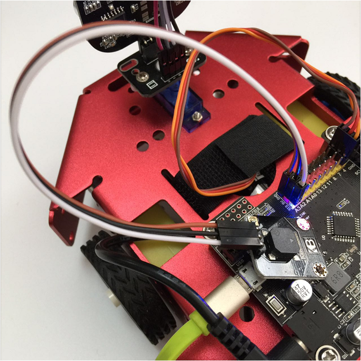
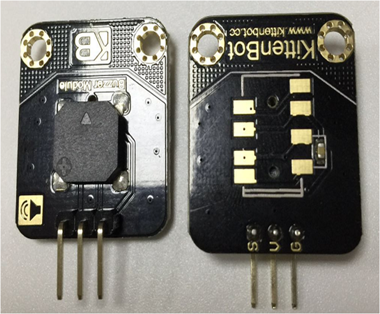
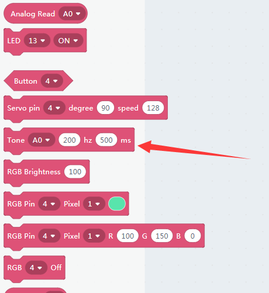
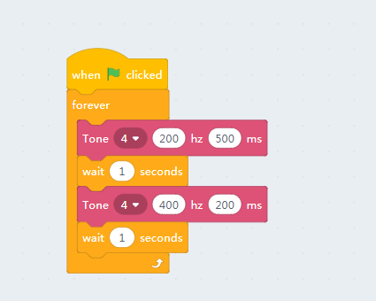
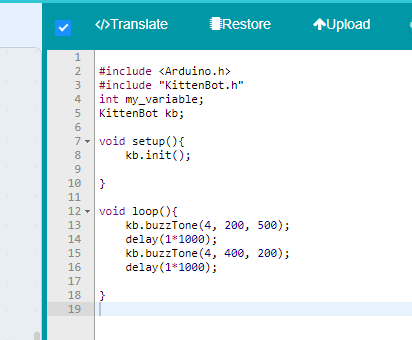
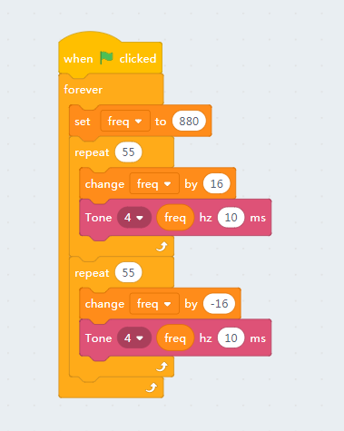

# Buzzer

## Wiring of buzzer module

The wiring is simple, just be noticing that rosbot mainboard has a series of 3pin extensions:

- Red pins: 5V power output
- Black pin: Ground
- Yellow pin: Signal

## Blocks for the buzzer

This block is to control the buzzer tone.

The first slot is which pin you are connecting to a buzzer. The other two slots indicate frequency and time duration.

You may test the buzzer module by hitting the block.

You may also check out the buzzer example to 'Beep, beep' in a different frequency.

And upload to the mainboard

## Siren effect

We may also make a police siren effect by doing some math and coding.

Sorry for that we can't show the sound effect on markdown, you have to test with your ears.

