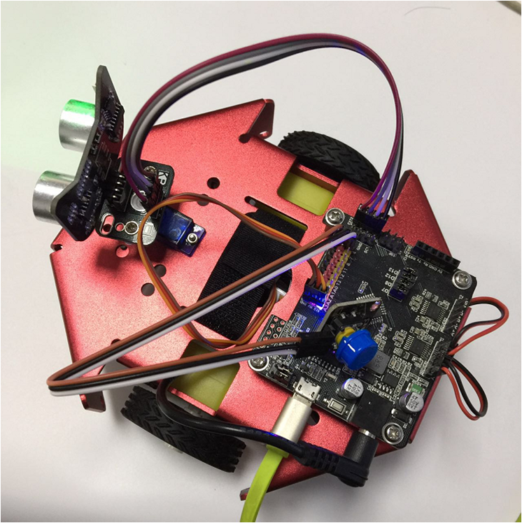
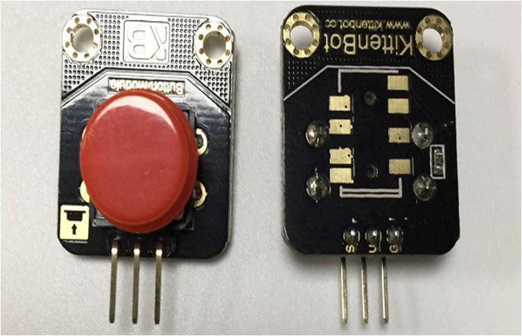
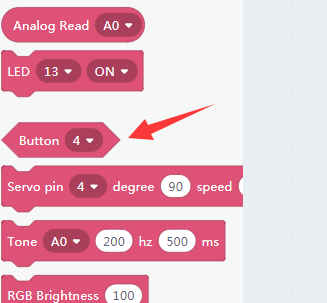
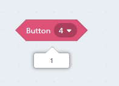
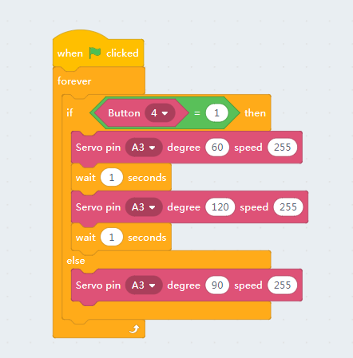
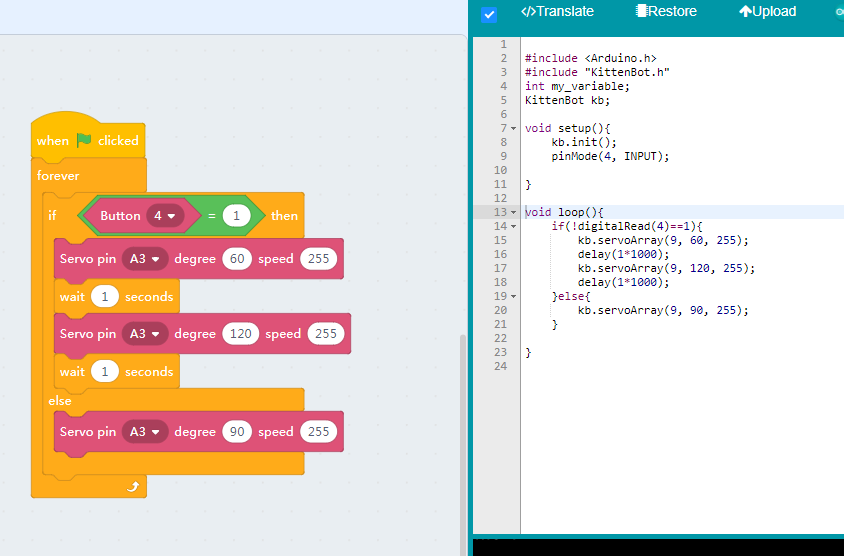
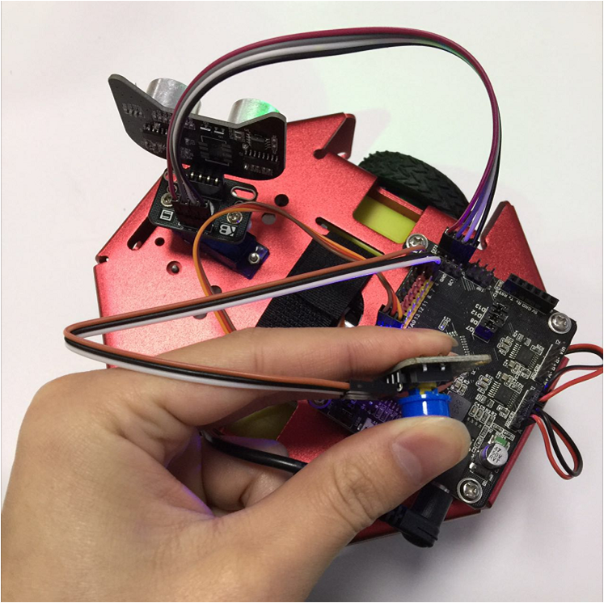

# Buttons

## Wiring of button module

As easy as buzzer module

## Blocks for the button

The button is of shape sharp corner, which means it will only return 1 or 0(true or false). 1 if you press the button, 0 if release. 

Please note that the button module is actually pull up, means it will return 0 if you read the raw pin level while pressing. We have inverted the return value internally.
 

## Read the button on the fly

**Make sure you have restored the firmware before using online mode**

Click the block and get the status report.

## Handling an Event

The button only executes once every time you execute it, no matter online or offline mode. So we need an infinite loop to continuously checking its status.

The demo code in our example is almost the same as the ultrasonic demo, the only difference is that we use a different trigger source.

By clicking the green flag to execute the code block.

## Translate to c++ and download

You can also start the motor the same way if you don't want the robot to start running right after reset. 
