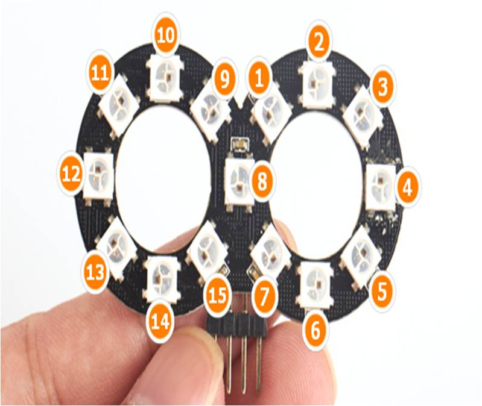
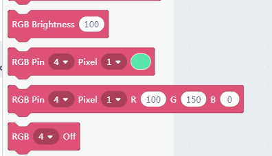
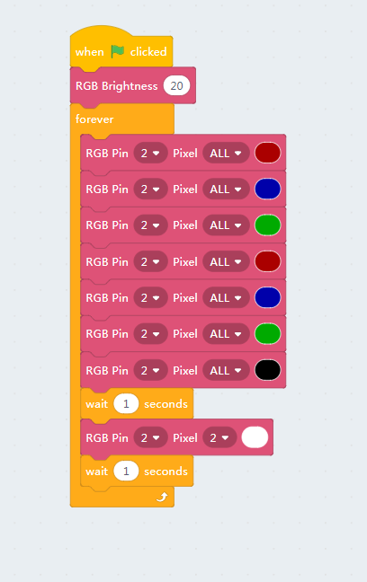
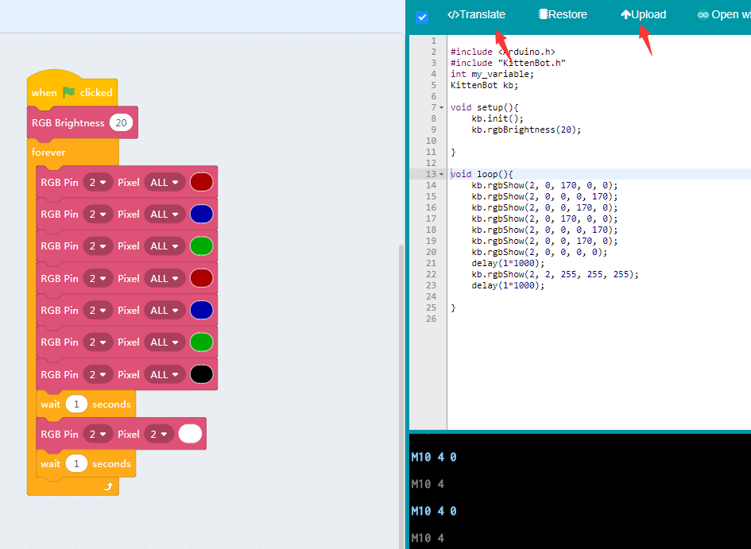
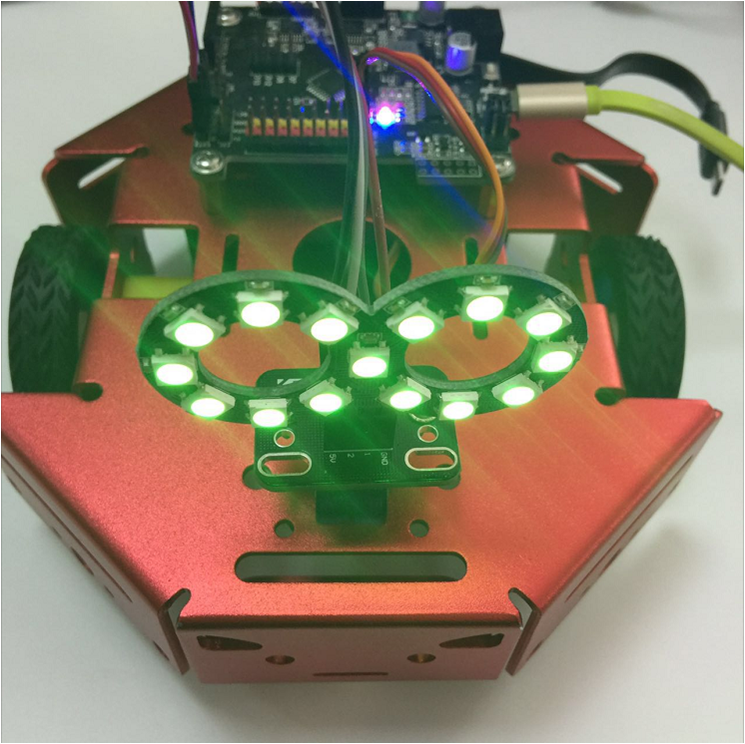

# The infi RGB ring

## The infi RGB Ring Module

The infi RGB ring may also plug into the adapter board.

Here we use the same wiring scheme as the ultrasonic module.

Adapter-Mainboard

- V —— 5V
- 1 —— D2
- G —— GND
- 2 —— D3

The pixel arrangement is shown in the pic below

## Blocks for RGB pixels

Here we have more than two pixels and more freedom of coding. The blocks for RGB are the same as chapter 5.

## Testing the RGB module

We make a simple blinking testing programme to loop between RGB colors. Please note that a **Black** actually means turn the RGB off.

**Make sure you have restored the firmware before using online mode**

Then we translate it to arduino code and download.

## The final effect

The chapter 7 to 9 could be kind of tedious but may get you familiar to kittenblock and the wiring process.

