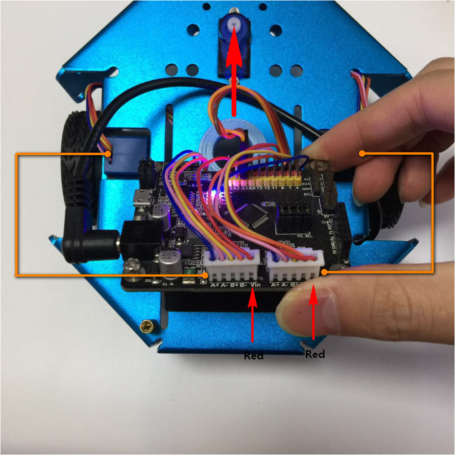
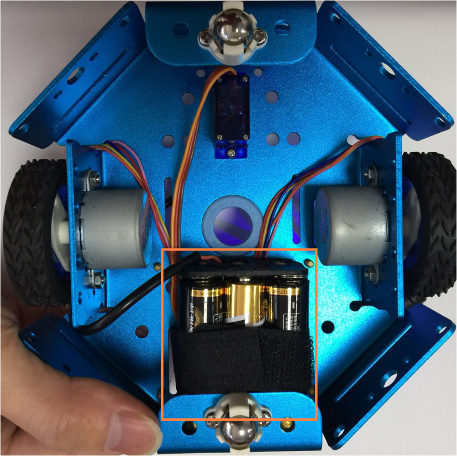
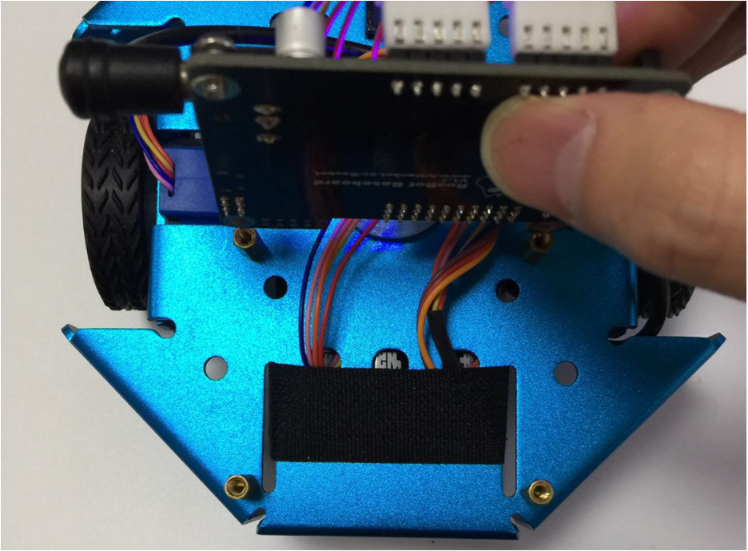
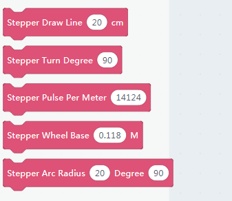
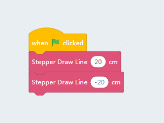
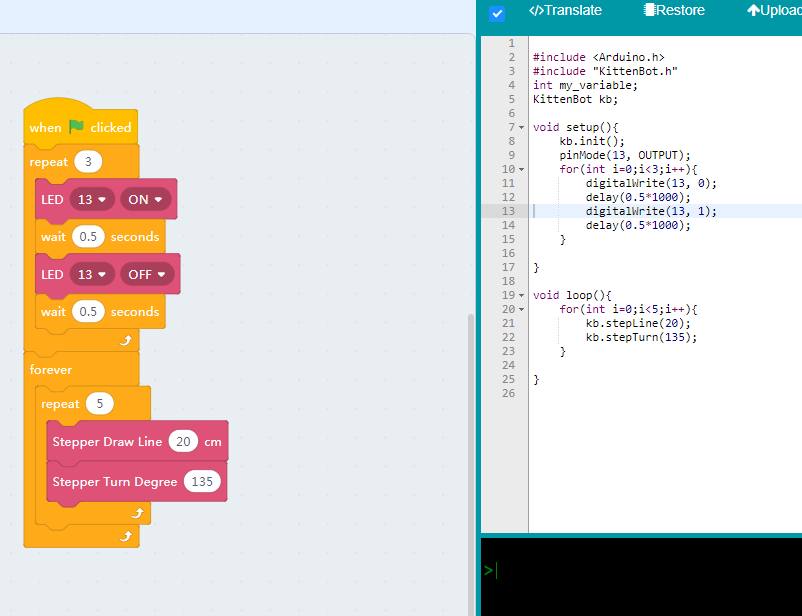
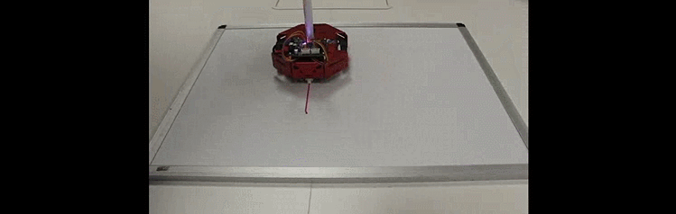

# Drawing robot

## Assembly

To transform your robot into a drawing robot, you may need to remove the DC motors.
And rewiring everything as shown in the pictures.

Each motor should connect to the correct motor socket.

**Big Notice: make sure the stepper motor's red wire connecting to *VIN*.**

Use the nylon tie to fix the battery holder to the chassis. 

## Block for steppers

There are many stepper support blocks in kittenblock. You may precisely move your robot, turn in precisely degree or even draw an arc. 

The **Pulse Per Meter** block is to calibrate the linear moving. The theoretical value is calculated by checking how many pulses we need send to steppers to drive 1 meter. You may fine-tune this value if you find the robot not moving precisely.

The **Wheel Base** block indicate the distance of wheels, this is also a theoretical value, not the distance you actually measure the wheelbase distance. This is used when calculating the turning degree and arc moving, you may find a clue in the kittenbot firmware source code.

## Drive in online mode

### Move forward and backward

**Make sure you have restored the firmware before using online mode**

Hit the block group and check if the robot move 20cm forward and back. Make sure you are still using USB cable connection, for now, we will show how to use wifi module to do the online mode functions later.

## Draw a Star

You may draw a five-angle star by turning 135 degrees around on each turn, that is the inner degree of a five-angle star.

Drag the code block as shown below, and burn it to the mainboard.

The robot may wait for 3s before start, with the LED 13 blinking.

Try turning the 135 degrees if you find the shape won't close very well. As there is a band of error in the real world.

## The finally moving

