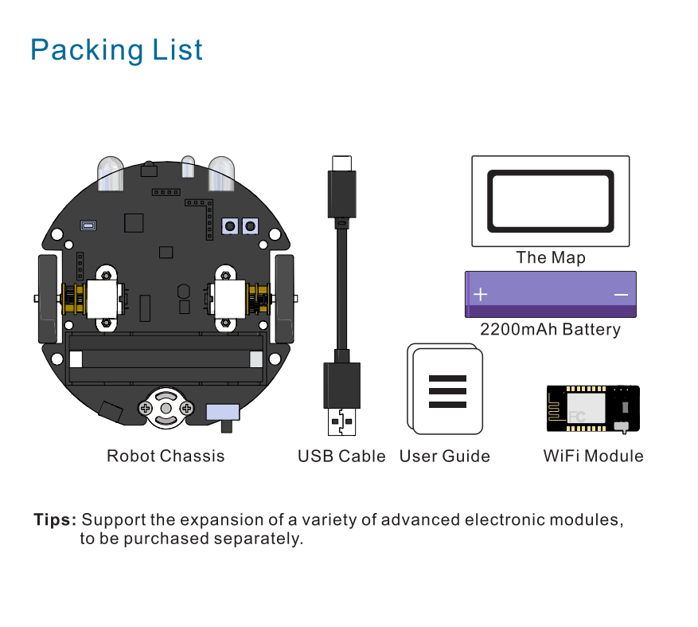
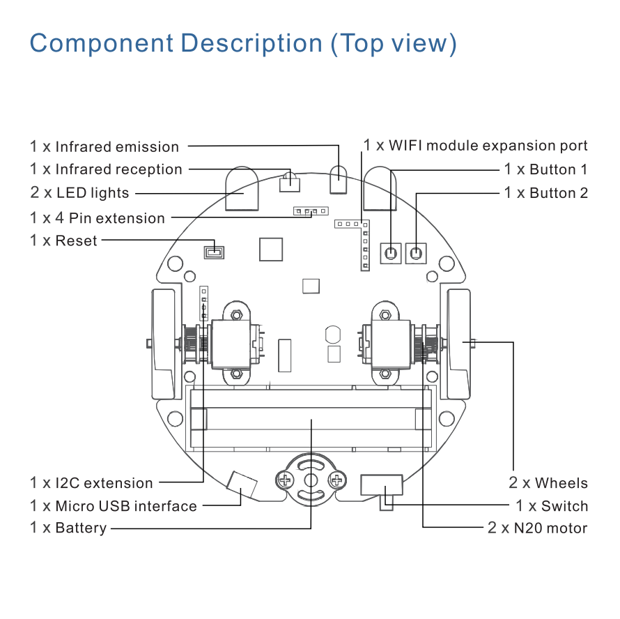
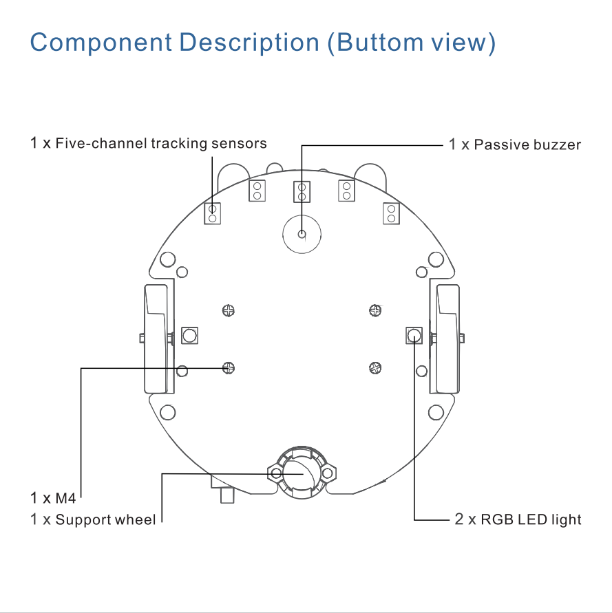
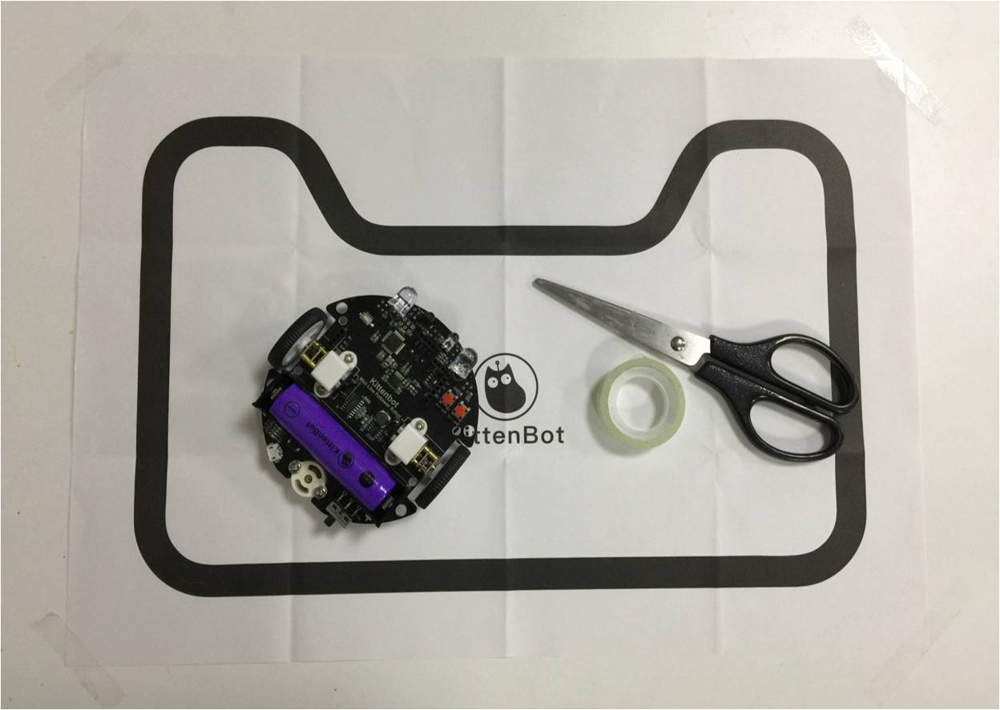
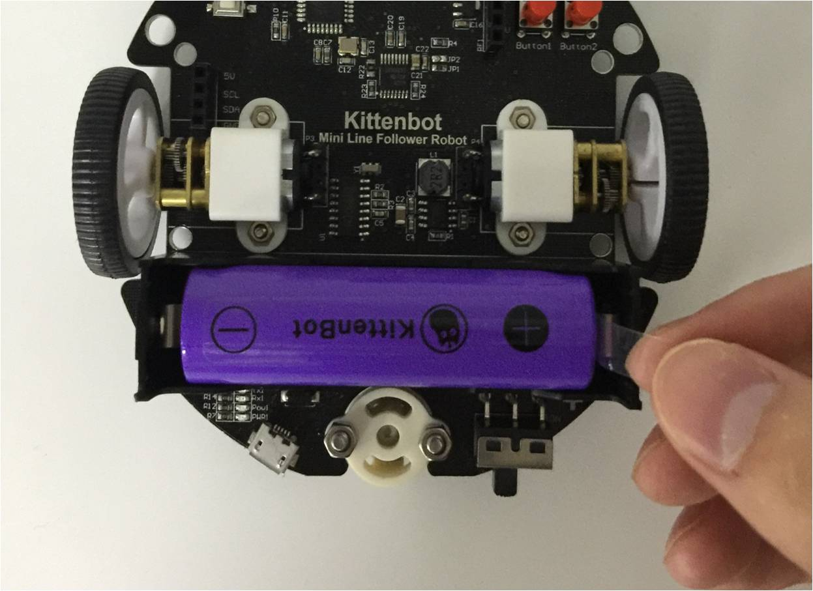
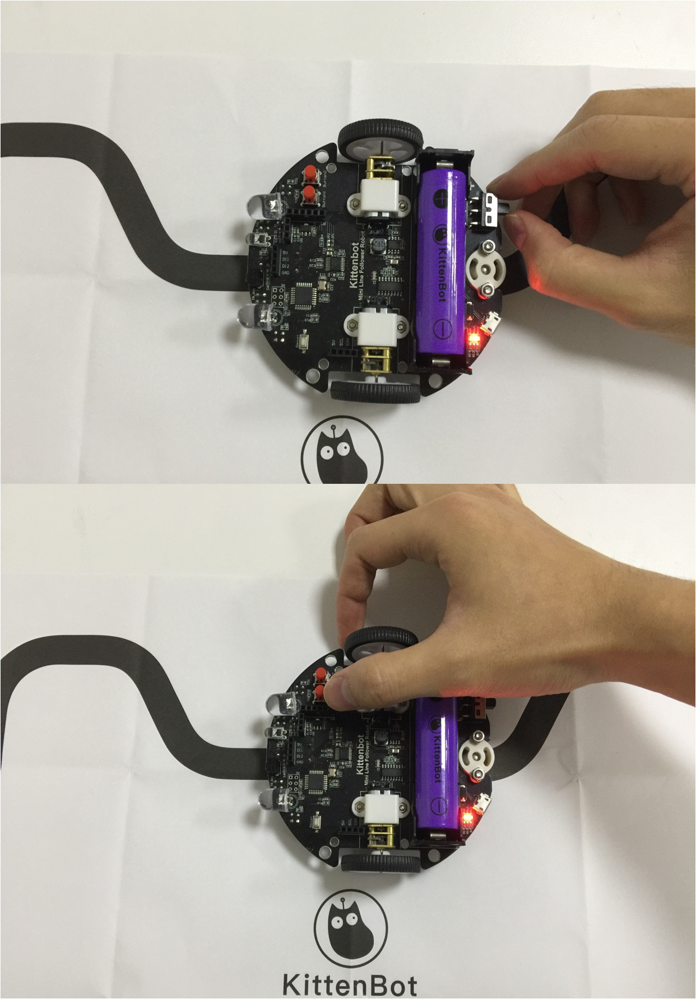
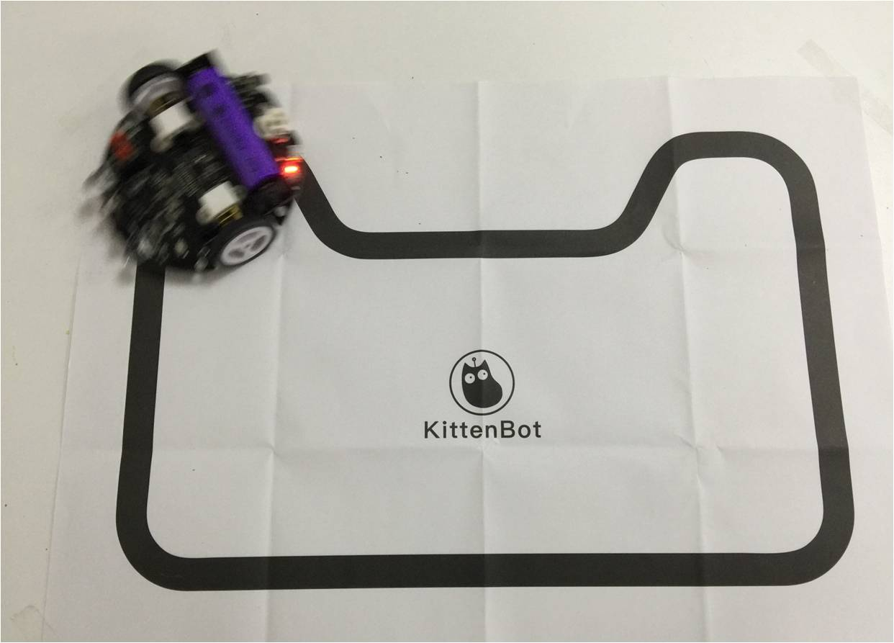

# Introducing of Mini Line Follower Robot

## Introduction to MiniLFR (Mini Linefollow Robot)

Thank you for choosing Mini Line Follower Robot (MINI LFR) from KittenBot team, it’s a set of friendly entry-level programming tools for kids, educators. The difference between Mini LFR and a similar robot is, you don’t need to learn how to wiring, just plug-in the modular sensors you can hands-on programming by KittenBlock.

To put children focus more on graphical programming without the need for complicated wirings, increasing the time for programming learning, and reducing the probability of errors. Improving children's programming confidence, put more time into logical thinking exercises than simple and repetitive wiring.

For the teacher, there is an out of box equipment for pre-school programming robots, and there is no need to draw energy to recollect and classified parts after class. Free teachers from house working and focus more on educating students.

For makers, this is a perfect prototype to hack or play with. The one-piece integrated PCB design saves you the cost of assemble everything from the ground up, and it is handy to use and quickly experience the fun of graphical programming. Greatly reduce the threshold for learning, so that everyone can learn from a simple educational robot.

## MiniLFR onboard resource

- Monochrome LED spotlight
- Colorful RGB hover light
- Infrared transmitter
- Infrared receiver
- Programmable button
- Metal geared DC motor
- 5X infrared line trace sensor
- Buzzer
- On board power supply and charger circuit
- WIFI communication, etc.

**If there are any missing items, please contact customer service for help**

## Quick Start of line follow mode

There is build-in line follow PID algorithm in factory firmware. You can upgrade or recover firmware with latest Kittenblock

### Prepare the map

Use transparent tape to stick the four corners of the map and flatten the map as much as possible. Otherwise, the uneven paper surface will be in effect the algorithm.

*We recommend to paste black tape directly on the ground or desk.*

### Prepare the Car

Pull out the LFR's battery plastic baffle. Someplace in the planet has a strict shipment of battery, so you may get a piece of 18650 battery locally. Any kind of 18650 battery with 1 cell(3.7v) should work fine. 

Put the robot in the center of the black line on the map.

Then turn on the power switch in the back center of the robot.

### Calibration the infra sensor

Long press button 1 (pictured), the car will play a short melody, and then with 2 short “DI-DI”. Handoff and let go. The car enters the automatic calibration mode, rotates in place, stops after calibration.

If you got V2.0 of MiniLFR, the red is button 1 and blue is button 2.

### Press the button to enter the line follow patrol mode

Press button 1 again, after the same short melody the robot will enter line patroling mode.

## MiniLFR FAQ

### My robot always go out of line

Please re-calibrate the sensor, re-paste your map or use black tap directly. Check if the five sensors are all in their position.

### Does the line patroling mode need to plug in the wifi module?

No, the wifi module is for wireless control or programming

### Can I unplug the battery.

We recommend not to, you can recharge with USB cable.

### Will I damage inversely plug in the battery?

For old MiniLFR users, be careful when you change the battery.

For V2.0 MiniLFR users, there is inverse protect circuit.

### How to charge the robot

Use an ordinary mobile phone charger or computer USB port to charge the car via the micro USB port. Charging voltage 5V, current 1A or more.

### How long to charge?

With 5V1A input，fully charge will take two and half hour.

### Will the motor damage on stuck?

It will damage the motor's gearbox if it stuck for a long time. But will be ok if block for a short while.

### WIll it damage on free fall?

The MiniLFR use metal gearbox, if it drops from the high ground to the bottom, it may cause the gearbox to deteriorate. Be careful when you play it on the table. Make a fence or something prevent free fall. You may connect our customer service for spare parts.

### What is the function of button1 and button2?

For factory firmware, button1 is used to enter the line follow mode. button2 is to trigger object avoid mode, you will need an ultrasonic plugged on. 

### How to programme the MiniLFR？

We have provided a PC software named Kittenblock

### My robot won't start line follow mode after pressed button1

- Please check whether the switch is turned on?
- Is the power indicator of the car bright? Did battery die?
- Is there a factory firmware on board?

### Will the factory firmware lost？

Never, unless you re-programmed it.

### How to recover factory firmware？

Please use Kittenbot Team 's Kittenblock.
