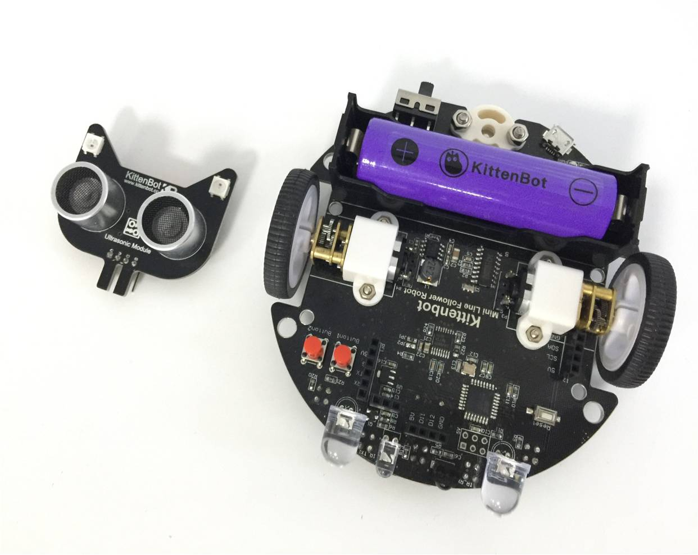
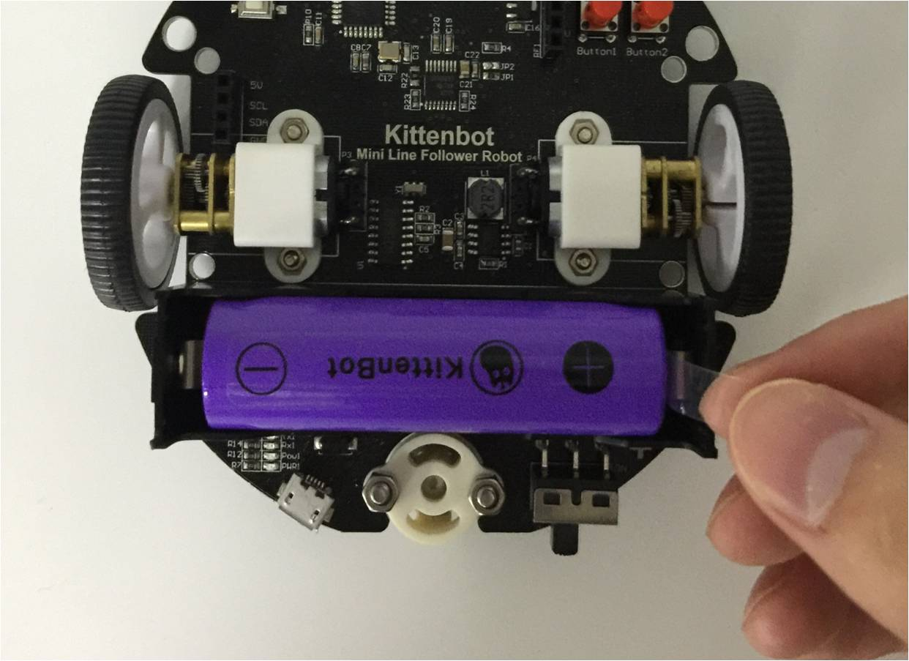
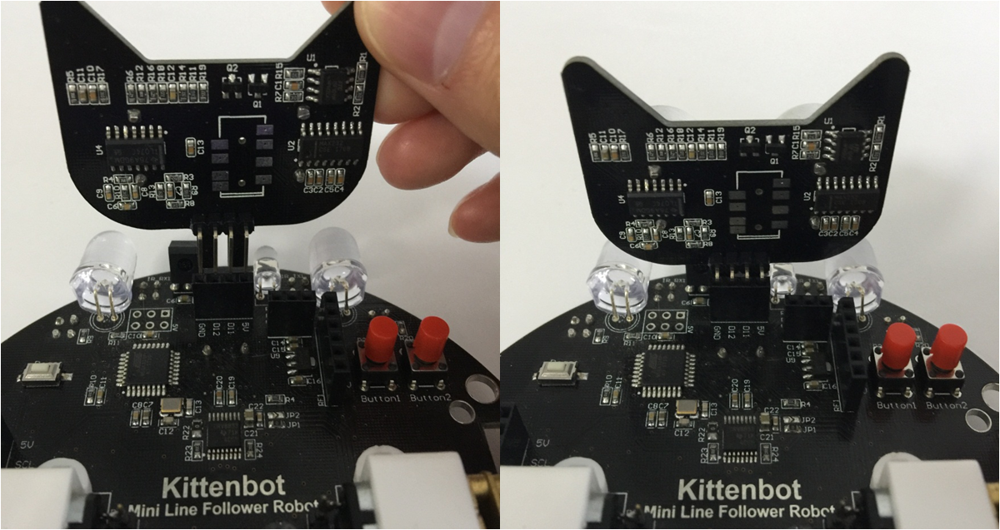
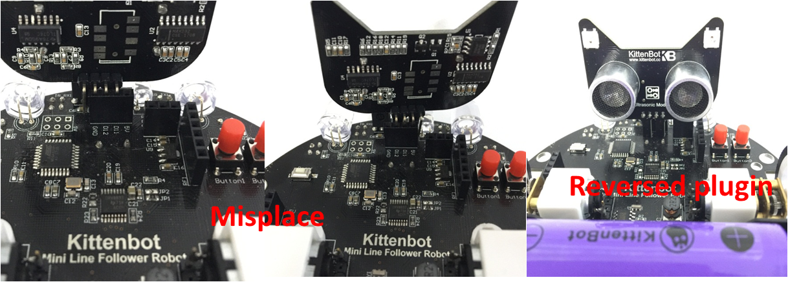
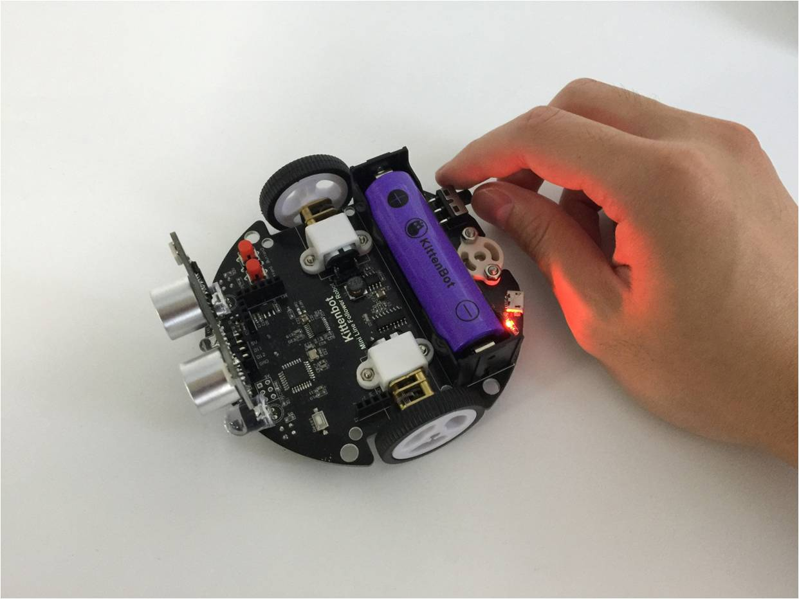
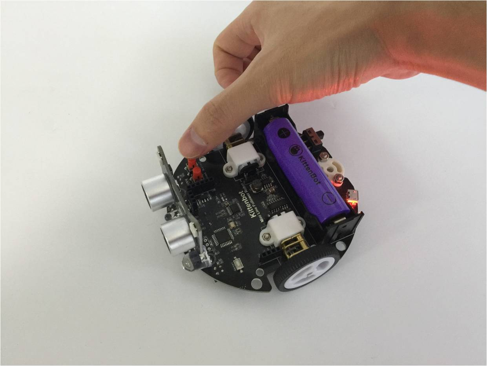
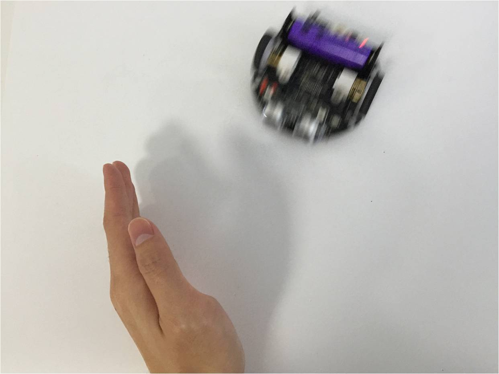

# Out of box object avoidance mode

## The Object avoidance mode

The second inherit function of factory firmware is to let the robot tango around and avoid objects in front.

You will need the ultrasonic sensor(NekoMimi Module) shipped with MiniLFR kit.

## Steps

### Prepare the ultrasonic sensor and MiniLFR

### Prepare the ultrasonic sensor and MiniLFR

Pull out the LFR's battery plastic baffle if you haven't done this yet.

 

### Install the ultrasonic sensor

Double check if have installed correctly as pictured, otherwise may damage the hardware.

The **wrong** way to install the module.

### Power on

Power on the robot and press button2, the button close to the edge(or the button in blue if you have v2.0)

After two short beeps, the robot will enter object avoidance automatically

If the ultrasonic sensor finds something in front, it will move backward a little and then turn to a new direction to go.

