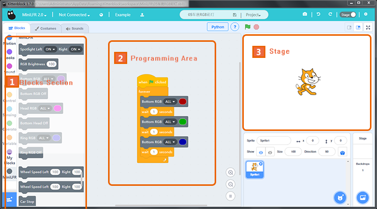
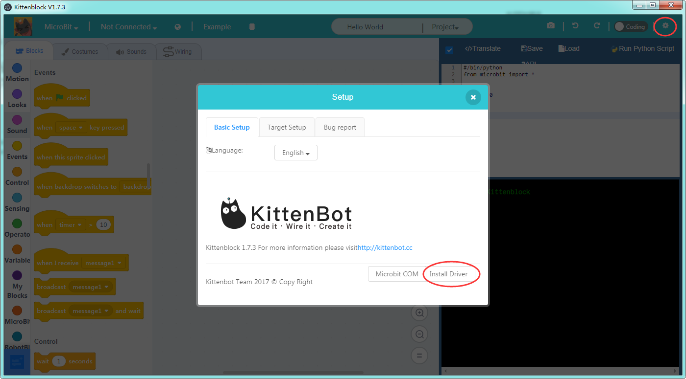
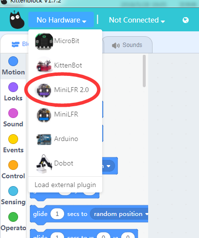
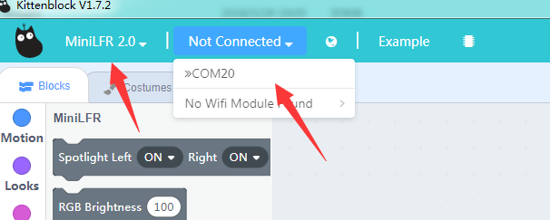
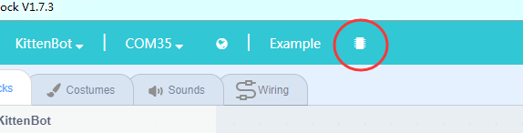
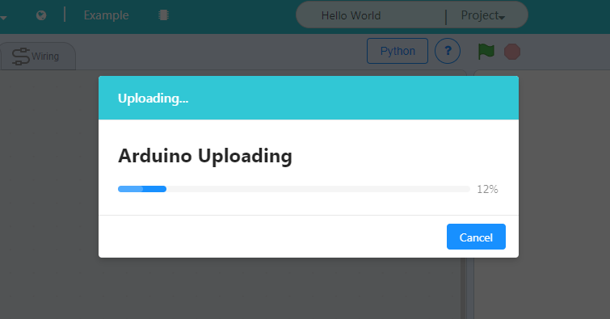
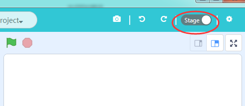
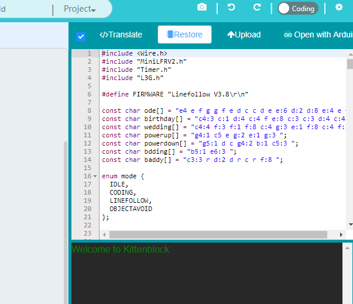

# Install Kittenblock

If you have successfully tried the line follow mode and obstacle avoidance mode of MiniLFR, congratulations that you are already getting started.

## The Kittenblock Graphical programming software

Your experience is just the tip of the iceberg. The function of the MiniLFR does not stop there. It differs from toy cars on the market. Its charm lies in its ability to control various sensors on the car through autonomous graphical programming.

All Kittenbot products can be programmed via Kittenblock. Kittenblock is developed over the latest MIT scratch3.0 codebase and focus on hardware interacting. Kittenblock is designed for primary and secondary school programming education and personal enthusiasts DIY projects. We break the barrier between software and hardware by graphical programming.

**Features: low entry level, Get started quickly and understand it easily.**

The following picture shows the interface of Kittenblock. Kittenblock is based on Scratch3.0, the UI is visually very different from the Scratch2.0. 
The UI is brighter, more vibrant, and more consistent with the tone of young people learning. It is a graphical software that has a good experience in the market and supports the most electronic devices.

## Software Download

Basically, Kittenblock update every 1~2 weeks, due to frequent updates, there may be small bugs in different situations. Feedback and bug report are welcome, we will fix the bug as soon as possible.

### Download Link (Latest 1.72)
[Windows V1.72](http://cdn.kittenbot.cn/win/Kittenblock%20Setup%201.7.2.exe)

[MacOS V1.72](http://download.kittenbot.cn/mac/Kittenblock-1.7.2.dmg)

The installation process is simple, next step on each prompt. If your anti-virus firewall shoots a warning please bypass it and let us know. We will contact the anti-virus company for a false alarm. Please make sure you have downloaded the correct software according to your operating system.

If you encounter any problems during the installation process, you can post in our forum. We have colleagues who are responsible for the technical maintenance forums and will respond to them as soon as they see it.

### Driver Install

If your os is windows you may need to install USB-Serial drive to communicate with the mainboard. After kittenblock installed, click the gear icon on the top right header panel. Click install driver in the pop-up windows.

For win10 you may need admin privilege to start the driver install programme. Go to kittenblock install spot and inside the **drivers\ch340win** folder, you may find the driver install programme. Right-click and execute it with admin privilege.

## Quick start of Kittenblock

Here are the main steps to get start of your robot kit.

### Select **MiniLFR** in the up-left drop down

*If you have MiniLFR V1.5 type, please select MiniLFR other than MiniLFR 2.0*

### Plug in the USB cable to the back of MiniLFR, then select the right serial communication port

If you can't find the communication port please check if the driver installed correctly.

### Click the chip icon next to example to restore firmware

It may take 10~20 seconds to finish the restoring process. 

### Now you are good to go

## Second way to restore firmware

### Switch to code panel

### Click the *Restore* button then the *Upload* button

You may also check the source code of firmware here.

## Wifi Communication

In some case across this tutorial, we may use wireless communication to get a better experience or result. Please refer [the wifi setupping guide chapter](http://learn.kittenbot.cc/en/latest/kittenbot/11WifiUploading.html) in kittenbot, they are the same.

## Summary

Successfully go through the steps above has proven that you have successfully started the Kittenblock graphical programming software, next tutorial will start the actual programming.

When you are familiar with all the functions of the car, you can program it at your own pace.

Then summarize the steps:

- Plug in the USB cable
- Select robot type in the software, serial communication port
- Restore firmware

If you encounter any problems with the above steps, please feel free to leave a message in our community [http://kittenbot.cc/bbs/](http://kittenbot.cc/bbs/) or email us info@kittenbot.cc

