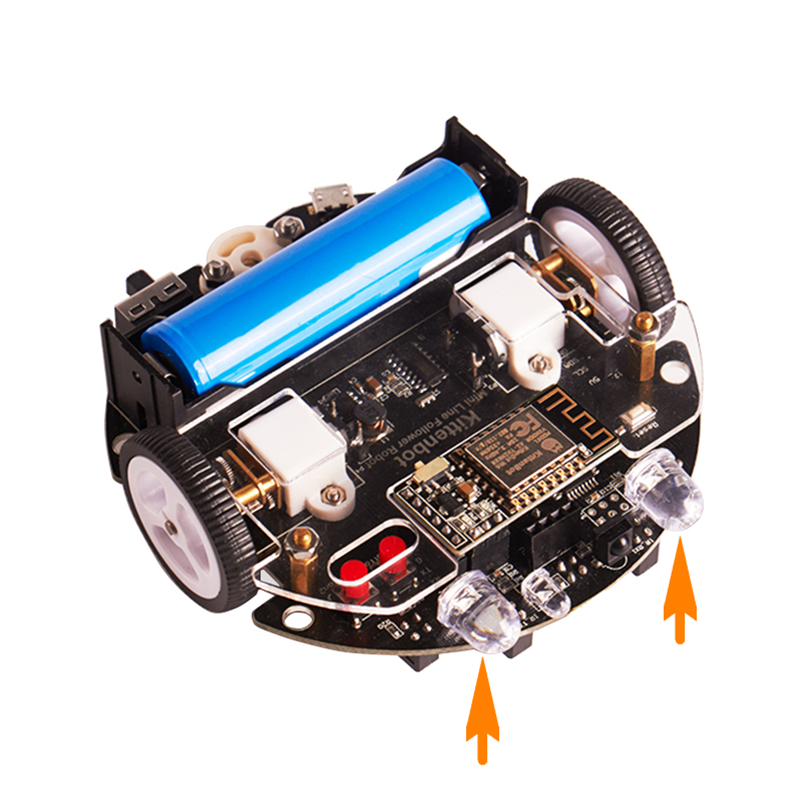
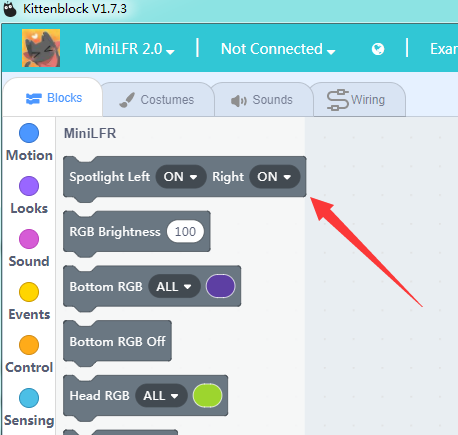
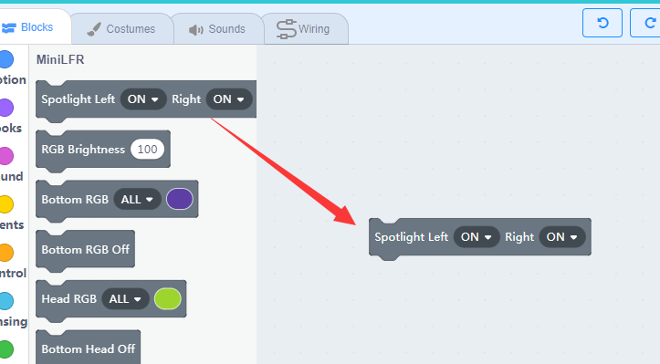
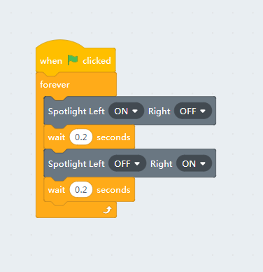
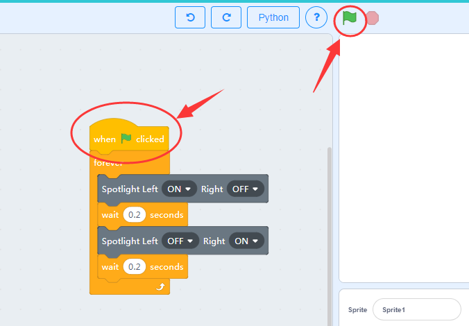
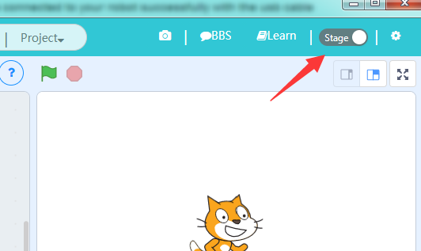
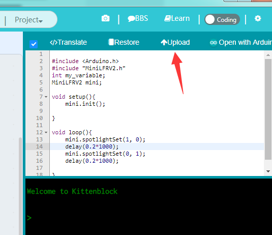
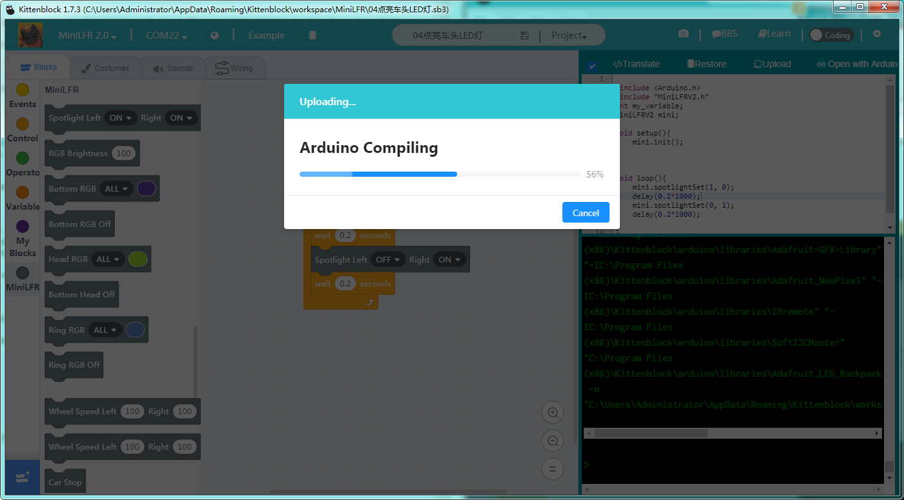
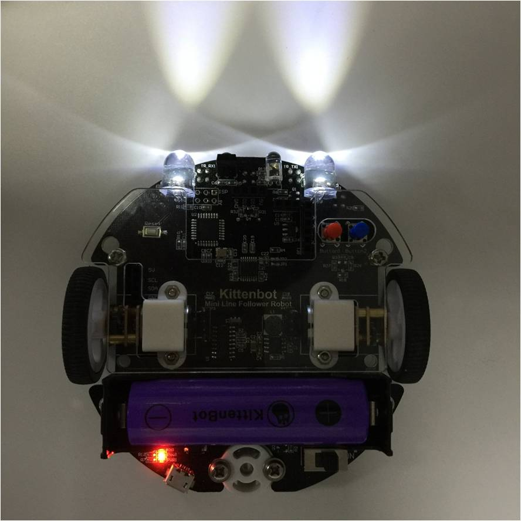

# Spot Light Control

## The Spot Light

## Block For Spotlight

This is the block to control the spotlight on each side.

## Blinking

**Make sure you have connected to your robot successfully with the USB cable**

Drag the block to the workspace area and change the status of the left and right lights in the drop-down list.

Here we make an every basic blinking programme.

You may start the code by clicking the green flag on top of the green flag button above the stage. The spotlight will flash in order.

If you unplug the USB cable or close the communication port the programme will stop. The is what we call **"Online Mode"**. In Online mode, you have always to maintain a communication between the computer and the robot, via serial port or wifi. 

We will talk about how to use the wifi module later, for now, use USB cable only.

## Burn it the robot

There is another **Off mode** in respect to the **Online Mode**. The offline mode doesn't need a communication between the robot and the computer, actually it turns you graphical block into real C++ code and compiles then burn to the main chip on the robot. This is how the most electronic device works in life.

To translate the blocks to c++, we have to go coding mode. Toggle the switch in the upright panel.

You may find that the c++ code already translated from the graphics blocks. If not, click the translate button.

The next thing to do is click the **upload** button and wait until the upload process finished.

The compiling in progress, if no errors in the translated code it will start to download the compiled hex file to the robot.

## Blinking 

If the download is unsuccessful, check:

- Is the board type selected correctly?
- Is it connected to the COM port?
- Is the USB cable connected?
- Is the compile finished without errors?

If none of the above can solve the problem, please contact us and we will serve you sincerely.

