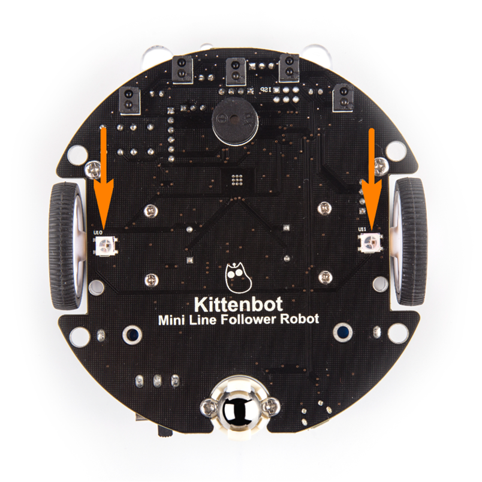
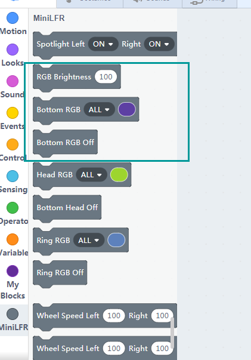
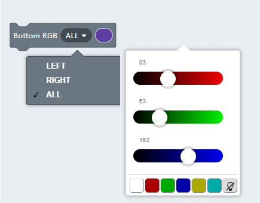
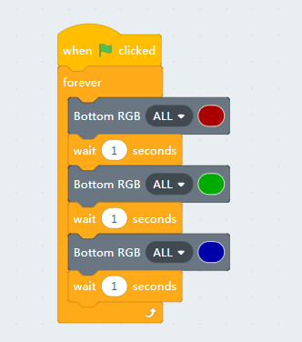
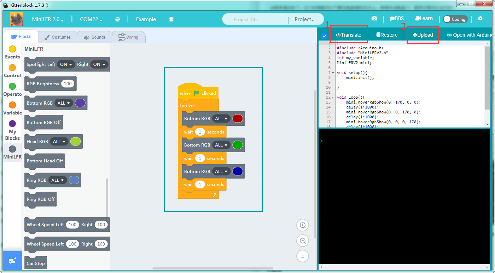
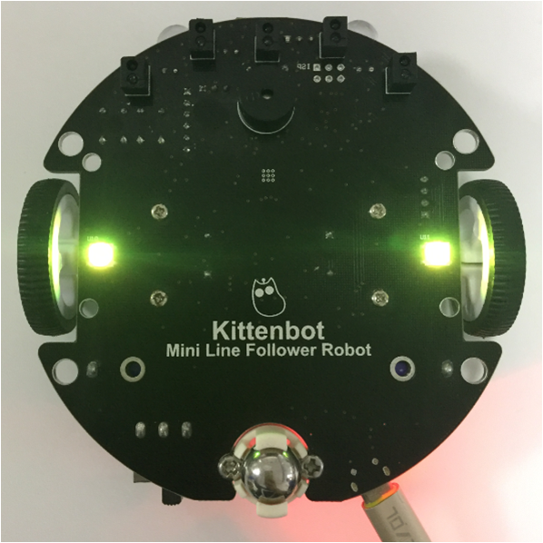

# The Hover Light

## Hoverlight position

## Hoverlight blocks

This block is to control the RGB lights in the bottom.

- Brightness
- color
- and off

## Detailed bottom RGB blocks

You may select which pixel to control in the first slot. And select your desired color in the color drop-down.

## A looping color programme

Here we make a very basic color looping programme, make sure you have **restored the factory firmware** before testing in online mode.

You can also make your own combinations by modifying the code. Click the green flag block on top of the green flag button to start.

## Offline mode

## The effect

