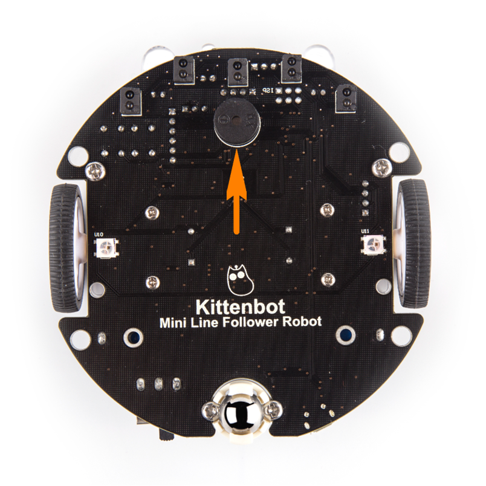
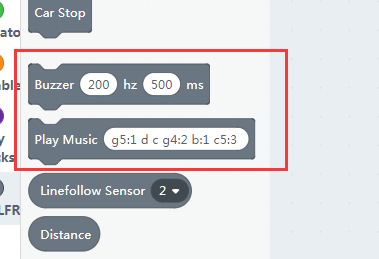
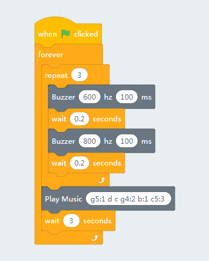
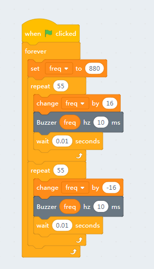

# Buzzer

## Buzzer's position

## Blocks for a buzzer

The first block simply lets the buzzer tweet, the second block may output a melody. The melody notation definition locates at the micropython's music tutorial page. 

[http://microbit-micropython.readthedocs.io/en/latest/music.html](http://microbit-micropython.readthedocs.io/en/latest/music.html)

We have port it to arduino, you can find the source code in the minilfr library under kittenblock's install location. 

## Buzzer test code

Here we make a simple buzzer test code, you can also download it to the robot.

## Make a police siren

Let's make something fun, here we use a variable and increasing loop to simulate siren of a police car. 

You may find that the effect is a little cracky, no problem, translate it into arduino c++ and burn to the robot and check again. The offline code runs way more smooth than the online mode, this is because in online mode kittenblock send instructions line by line, it takes much time in the communication and instruction decoding. 

