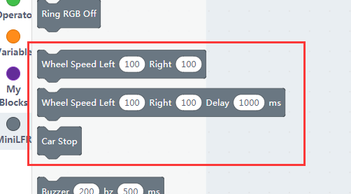

# Motor Control

## The Motors

The motors of MiniLFR use N20 dc motor(3V) with metal gearbox, the reducer ratio is 1:30. If you need replacement, please tell the provider these parameters.

## Blocks for motors

The speed value ranging from -255 to 255.
Positive speed makes the motor roll forward, and vice versa. The second block with a delay control, the robot will stop after milliseconds passed.

## Motor rolling

Here we demonstrate how to make the MiniLFR go forward and back then rotate in the ground.

If you find the USB connection not so convenient, please refer this post on how to use the wifi module, it is based on Kittenbot but works with MiniLFR.

[http://learn.kittenbot.cc/en/latest/kittenbot/11WifiUploading.html](http://learn.kittenbot.cc/en/latest/kittenbot/11WifiUploading.html)

You may use wifi communication for online mode, and make minilfr a remote control car. Of cause, you can download it into the robot too.
