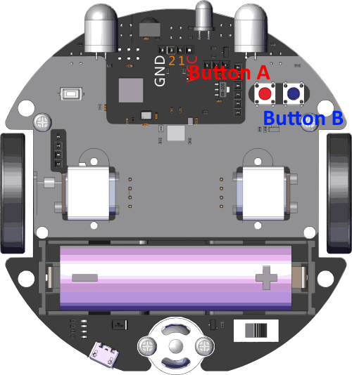
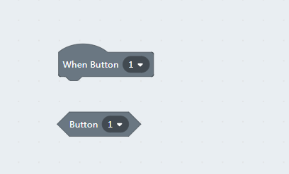
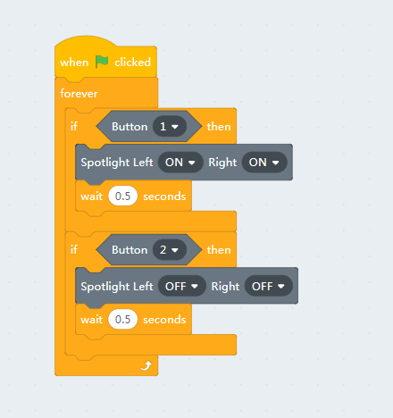
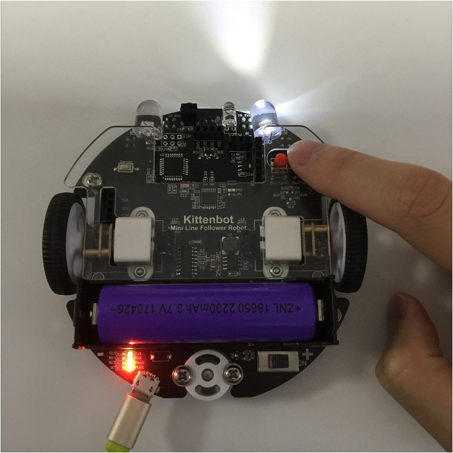

# Buttons

## The buttons of MiniLFR

The index of buttons demonstrated in the picture below.

## Block for buttons

The first block is a **hat** block type, which means this is a trigger source for following events.

The second block is a **boolean**, it will return true while the buttons are pressed. Be noticed that report/boolean block will only return value when it is executed, but hat type will be triggered once the condition met. 

## Loop reading

Let's make use the buttons to control the spotlight. In the following code, we use while looping read first.

We add 0.5s delay for button debouncing and prevent retry to quickly.

## Button as a trigger source

We can also use hat block here and makes the code more concise.

The hat block not only works in online mode, but you can also translate into arduino c++.

    #include <Arduino.h>
    #include "MiniLFRV2.h"
    int my_variable;
    MiniLFRV2 mini;
    void _callback_BUTTON_1(){
        mini.spotlightSet(1, 1);
    
    }
    
    
    void _callback_BUTTON_2(){
        mini.spotlightSet(0, 0);
    
    }
    
    
    void setup(){
        mini.init();
        mini.registerCallback(BUTTON_1, &_callback_BUTTON_1);
        mini.registerCallback(BUTTON_2, &_callback_BUTTON_2);
    
    }
    
    void loop(){
        mini.loop();
    
    }
    

The `mini.loop` function do all the event housework in the main loop, just like any operating system routine.

