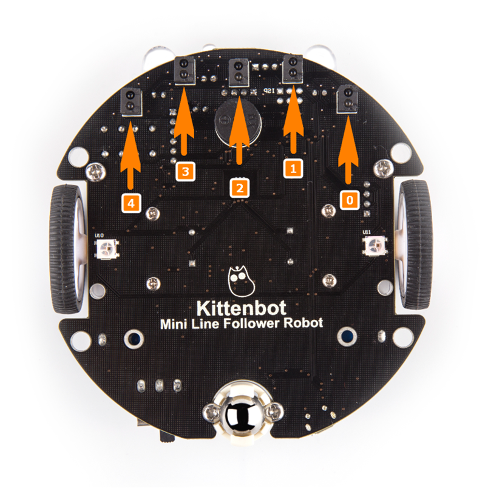
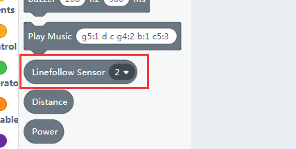
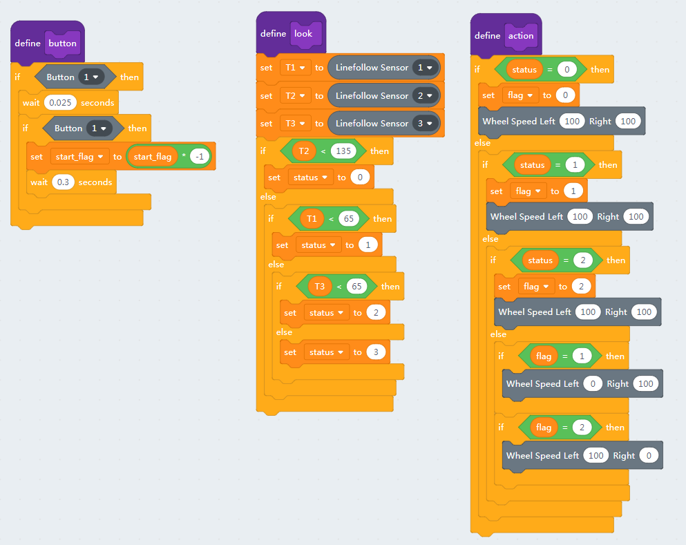
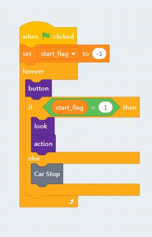

# The Infra Sensors

There are five infra transceiver sensors mounted in the bottom of MiniLFR, as shown below. 

These sensors are used to detect the black tap track below.

## Hardware of Infra Sensors

The index of sensors demonstrated in the picture. 

## Block for infra sensors

Please see the first picture for the slot indexes. 

There is only one block for the infra transceiver sensors in kittenblock, the other two infra related blocks are for the infra remote controller we will talk about it later.

## Read the sensor

Put the MiniLFR on a black tap, click the sensor reading block to see what the sensors report relative to on or off the tape. And the value also varies by the distance to the tape, this is why you need to flatten the map. 

The return value of the sensor reading block is already calibrated, which may eliminate the hardware difference between these sensors. You may calibrate the sensors again to see if the same.

## Simple line follow algorithm

Here we make a very simple line follow by using the graphical blocks.

We make three separate functions:

- one to check the button's state
- one to read the sensor's values
- one to execute

Then merge these guys together in the main loop

You may need a wifi connection here to debug the code. Modify the threshold value in the **look loop** based on your actually reading.

Once the coding works in online mode, try to solidify the program to make it run more smoothly.

 