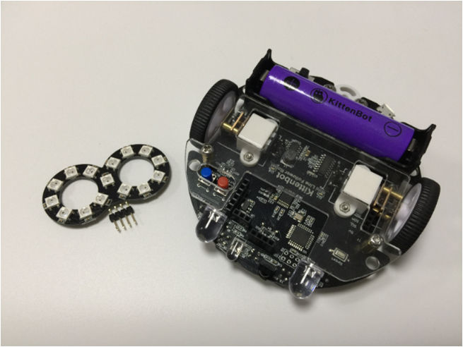
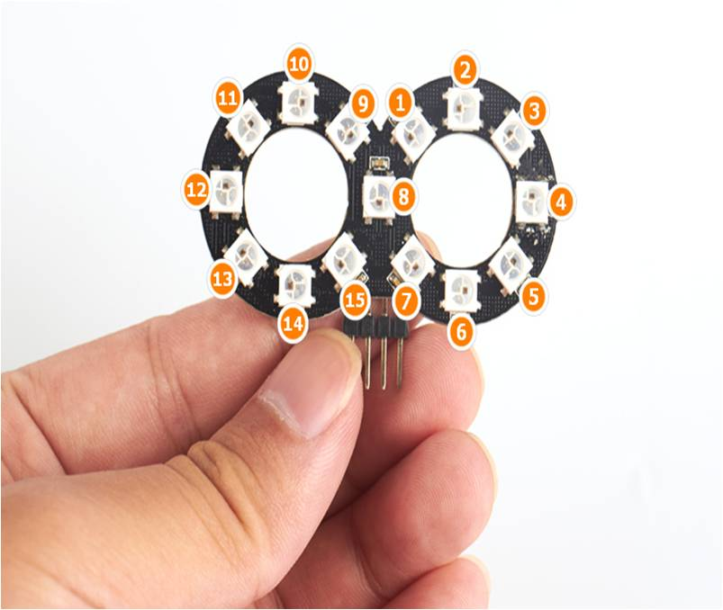
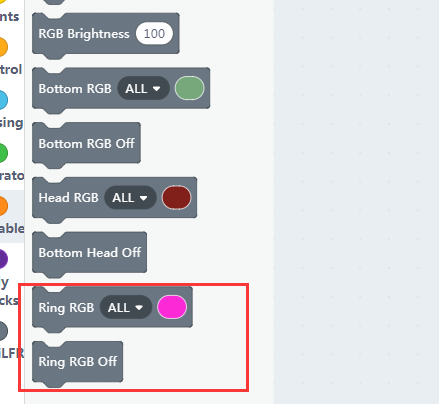
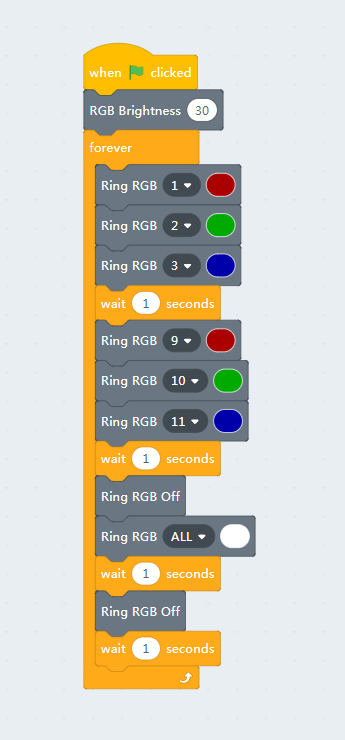

# Infi RGB Ring

## Hardware of RGB Ring

You may plug the RGB ring module directly to MiniLFR

Check the pic below to see how the pixels arranged.

## Block for the RGB Ring module

Notice that in kittenblock there are three different sets of RGB controlling blocks, but they all share the same bright setup.

## Controlling the pixels

More pixels means more freedom, take a try of the code shown below. You can also download the code to the main chip.

The RGB ring is based on most commonly ws2812, you can also connect your own RGB stript to MiniLFR by doing some wiring.

