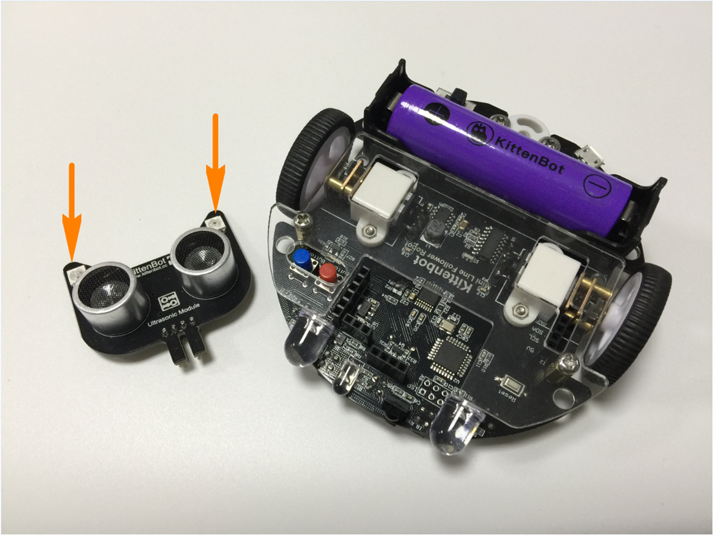
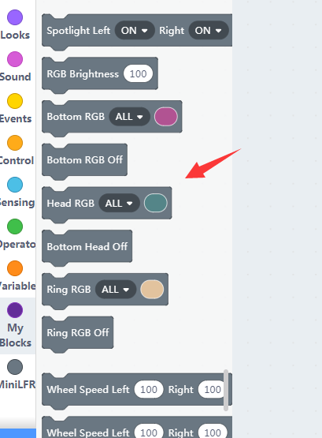
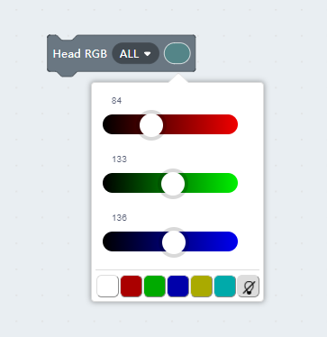
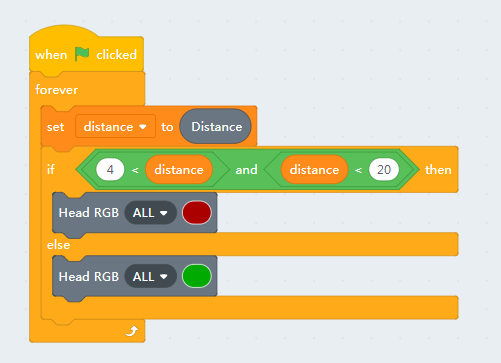
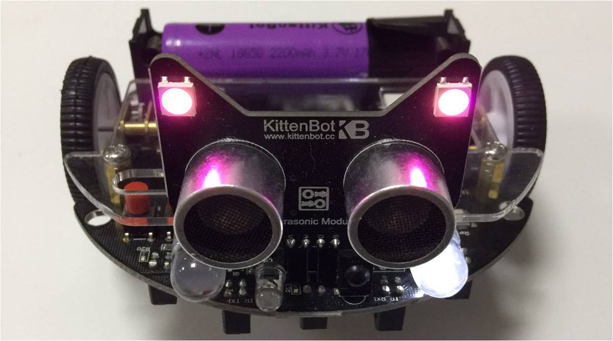

# Nekomimi RGB pixel

## The Nekomimi Module

There is a very cute ultrasonic module shipped with the kit. We give it a cute name too, ‘NekoMimi’ which means cat’s ears.

In this part, we only show you how to control the RGB pixel on each ear.

## Blocks description

You may change the color of each or all pixel by setting the color in the second slot.

## Color by distance sensing

Here let's create a small programme that reacts to the distance reported by the ultrasonic sensor.

Both pixels on the ears will turn red if you put your hand close in front the module.

