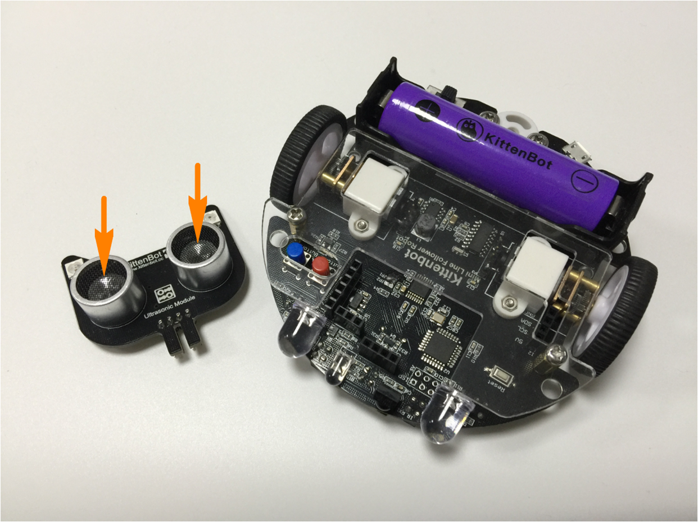
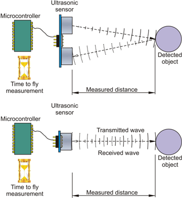
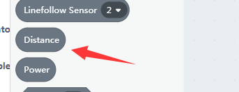
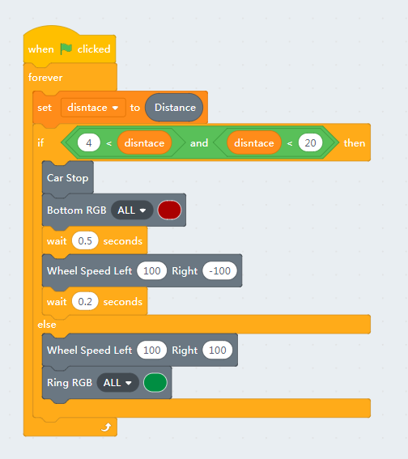
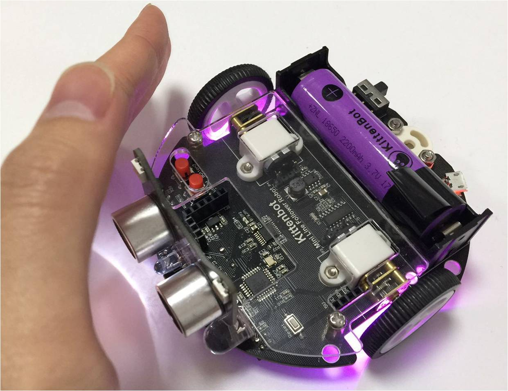

# Nekomimi Ultrasonic Sensing

## Hardware

The two ultrasonic transceivers mount in the front of module PCB, one to transmit 40k Hz sonic waves and the other one will catch it. The amplifier and logic circuit will count the time of fly and report to the main controller, the MCU will calculate the distance the distance based on the speed of sound in air.

## The distance blocks

You can get the distance by clicking or execute the block in your code. The return unit is centimeter.

## A simple object avoidance programme

We have already used the distance block in the last chapter, we just add two more motor rolling blocks here and make it into an object avoidance programme. You may also upload this programme to the robot. 

PS: the nekomimi module only uses one pin for distance sensing, the one marked with **D** on the PCB.
