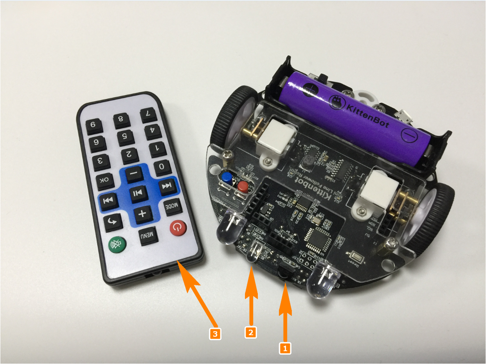
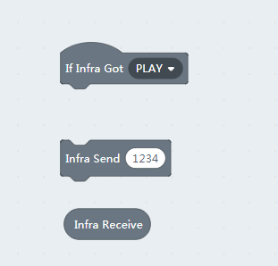
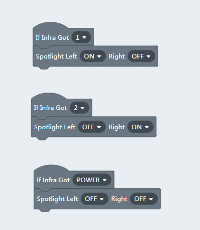
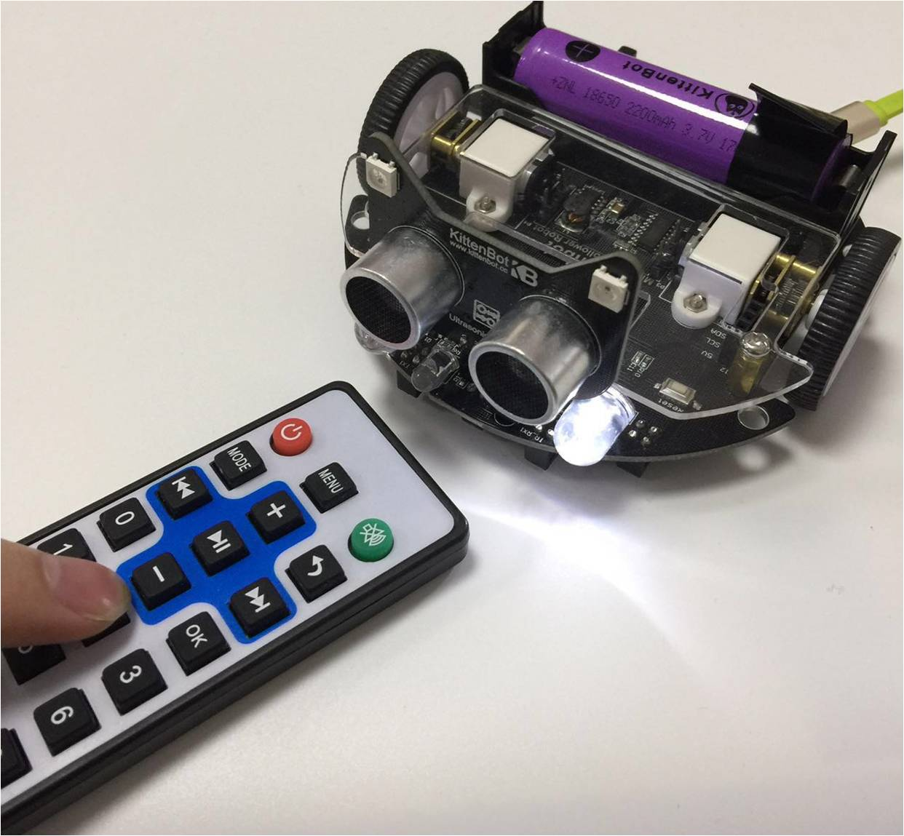

# Ir Remote Control

## The infra transceivers

- Infrared receiver may accept infrared coded data
- Infrared emission tube can emit infrared coded data
- Infrared remote control can transmit coded key data

You can also make multiple MiniLFRs talking to each other by their transceivers.

## Ir transceiver blocks

There are three blocks designed for the IR communication. 

The first one is a hat type block which triggered by IR controller commands. Note that this block output the decoded IR remote controller data, the raw data define can be found in the source code of MiniLFR libraries.

The next two block used to send and receive IR data in string or number format, the maximum transmit length is 8 characters.

## Spotlight response to ir remote controller 

These codes can be also translated to arduino c++ and download.

    #include <Arduino.h>
    #include "MiniLFRV2.h"
    int my_variable;
    MiniLFRV2 mini;
    void _callback_IR_1(){
        mini.spotlightSet(1, 0);
    }
    
    void _callback_IR_2(){
        mini.spotlightSet(0, 1);
    }
    
    void _callback_IR_POWER(){
        mini.spotlightSet(0, 0);
    
    }
    
    void setup(){
        mini.init();
        mini.registerCallback(IR_1, &_callback_IR_1);
        mini.registerCallback(IR_2, &_callback_IR_2);
        mini.registerCallback(IR_POWER, &_callback_IR_POWER);
    
    }
    
    void loop(){
        mini.loop();
    }

Each IR key registered a callback function at setup procedure, and the `mini.loop()` handle all the rest.

----------

