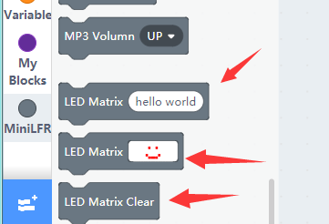

# The matrix display

## The matrix display module

You plug this module onto MiniLFR directly, just as the two modules mounted on MiniLFR.

## The block for the matrix display

There are 128 dots in the module, arranged in 16x8. It may display characters, numbers, symbols or icon.

We have created two blocks for matrix display module, one to manipulate the dots directly and the other to display string or number, and more blocks are on the go.

## Animation Loop

In the following programme, we scroll some number and string first. Any string length less then four will not scroll and just show up if you want it to scroll try to add some spaces after.

The inner loop we display a simple animated frame by frame and finally clean everything up.

